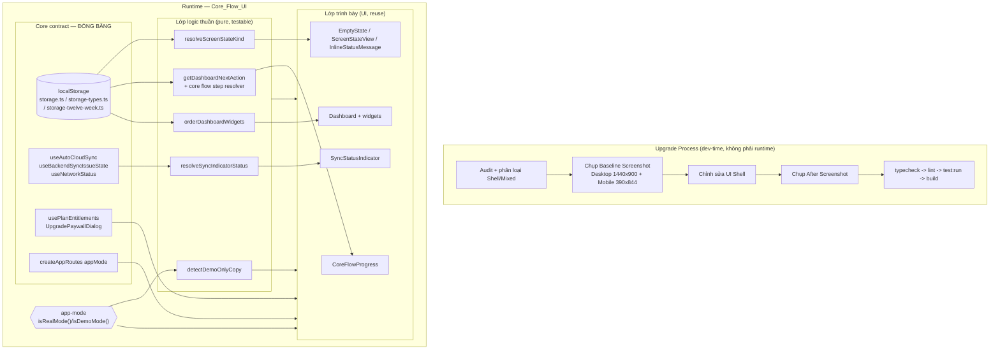
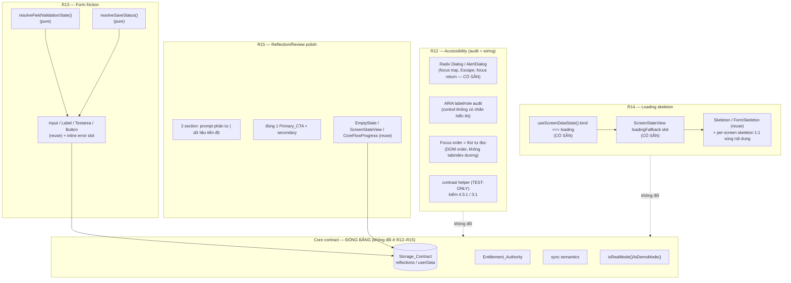

# Design Document — Core Flow UI Upgrade

## Overview

Tài liệu thiết kế này mô tả cách nâng cấp UI/UX của Core_Flow và Dashboard lên mức "production-polished" mà **không** thay đổi bất kỳ Core contract nào. Đây là công việc phân loại **Mixed** theo Hybrid SDD/ADD: phần lớn là **Shell** (layout, spacing, hierarchy, typography, empty/loading/error state, CTA, trình bày trạng thái), nhưng vì chạm tới hiển thị sync/auth/billing, điều hướng core flow và route availability nên phải **đóng băng Core contract trước**, rồi mới lặp trên Shell.

Nguyên tắc chủ đạo của thiết kế:

1. **Tái sử dụng, không tạo abstraction mới.** Codebase đã có gần như toàn bộ hạ tầng cần thiết: `CoreFlowProgress` (đã render "Bước M / N"), `getDashboardNextAction` (Next_Step_Guidance), bộ `states/*` (`EmptyState`, `ScreenStateView`, `useScreenDataState`, `InlineStatusMessage`, `LocalOnlyNotice`, `OfflineBanner`), các hook sync (`useAutoCloudSync`, `useBackendSyncIssueState`, `useNetworkStatus`), token design system trong `theme.css`/`tokens.css`. Thiết kế ưu tiên nối lại và chuẩn hoá các mảnh này thay vì viết mới.
2. **Core contract là bất biến.** Không đổi storage keys / data shape (`storage.ts`, `storage-types.ts`, `storage-twelve-week.ts`), không thay đổi Entitlement_Authority (`usePlanEntitlements`, `UpgradePaywallDialog`), không đổi billing route behavior, không đổi branching `isRealMode()` / `isDemoMode()` trong `app-mode.ts`.
3. **Quy trình kiểm chứng được.** Audit + baseline/after screenshot (Desktop 1440x900, Mobile 390x844) là bắt buộc; kết thúc bằng chuỗi lệnh `typecheck → lint → test:run → build`.
4. **Local-first tuyệt đối.** Mọi thao tác vòng 12-Week phải chạy được trên dữ liệu local kể cả khi backend/Firebase không khả dụng; sync chỉ là lớp best-effort được surface trạng thái, không phải điều kiện chặn.

Thiết kế chia thành hai lớp:

- **Lớp logic thuần (testable)**: các hàm quyết định như phân giải trạng thái sync, phân giải trạng thái màn hình, chọn bước kế tiếp của core flow, sắp xếp/phân nhóm widget, và phát hiện Demo_Only_Copy. Đây là nơi áp dụng property-based testing.
- **Lớp trình bày (UI)**: layout/spacing/typography, mobile-safety, brand preservation. Kiểm chứng bằng snapshot/DOM assertion, kiểm thử ví dụ và screenshot before/after.

## Architecture

### Sơ đồ tổng thể



### Ranh giới Shell / Mixed / Core

| Lớp | Được phép sửa | Bị đóng băng |
|-----|---------------|--------------|
| **Shell** | className/Tailwind, cấu trúc JSX layout, thứ tự hiển thị, copy production, empty/loading/error UI, spacing/typography theo token | — |
| **Mixed** | Cách **đọc & trình bày** trạng thái (sync/entitlement/next-step), cách **phân nhóm/sắp xếp** widget | Nguồn dữ liệu, semantics, điều kiện hiển thị gốc |
| **Core** | — | storage keys, data shape, Entitlement_Authority, billing routes, `isRealMode()`/`isDemoMode()` branching, sync semantics |

### Quy trình audit và screenshot (Requirement 1)

Đây là quy trình **dev-time** (không phải code runtime), thực thi thủ công/CLI bằng Playwright hoặc trình duyệt và ghi vào một artifact audit (ví dụ `docs/specs/core-flow-ui-upgrade/audit.md` hoặc bảng trong tasks). Không đưa vào bundle sản phẩm.

- **Audit table**: liệt kê từng màn hình Core_Flow + Dashboard với cột `screen id`, `classification` (đúng một trong `Shell` | `Mixed`), và với `Mixed` thêm cột `touched contracts` + `verified unchanged`.
- **Screenshot gating**: mỗi màn hình phải có Baseline (Desktop + Mobile) trước khi chỉnh sửa. Nếu thiếu baseline → **chặn** thao tác chỉnh sửa (Req 1.5). Nếu chụp thất bại → không đánh dấu hoàn tất + báo lỗi kèm screen/viewport (Req 1.7).
- **Contract guard**: nếu phát hiện một Core contract của màn hình Mixed bị đổi so với trạng thái đã xác nhận → dừng, không ghi đè, báo cáo contract bị đổi (Req 1.6).

Danh sách màn hình Core_Flow và phân loại đề xuất:

| Screen id | Route | Phân loại | Touched contracts (nếu Mixed) |
|-----------|-------|-----------|-------------------------------|
| Onboarding | `/onboarding` | Mixed | Storage_Contract (đọc/ghi `onboardingCompleted`, wheel of life) |
| LifeBalance | `/life-balance` | Mixed | Storage_Contract |
| LifeInsight | `/life-insight` | Shell | — |
| SMARTGoalSetup | `/smart-goal-setup` | Mixed | Storage_Contract, Entitlement_Authority (free tier limit) |
| FeasibilityCheck | `/feasibility` | Shell | — |
| 12WeekSetup | `/12-week-setup` | Mixed | Storage_Contract, route availability |
| 12WeekSystem (Today/Week/Progress) | `/12-week-system` | Mixed | Storage_Contract, sync, App_Mode |
| GoalTracker | `/goals` | Mixed | Storage_Contract |
| ReflectionJournal | `/journal` | Mixed | Storage_Contract |
| Dashboard | `/` (DashboardEntry) | Mixed | Storage_Contract, App_Mode, route availability |

## Components and Interfaces

Thiết kế **không** tạo component mới ngoài một số adapter/pure-helper mỏng. Bảng dưới nêu rõ cái gì reuse nguyên trạng, cái gì bổ sung.

### 1. Next_Step_Guidance & "bước M / N" (Requirement 2)

- **Reuse `CoreFlowProgress`** (`src/app/components/CoreFlowProgress.tsx`): đã hiển thị "Bước {index+1} / {N}" và danh sách bước. Không đổi API; chỉ đảm bảo mọi màn hình Core_Flow đều gắn component này với `currentStepId` đúng.
- **Reuse `getDashboardNextAction`** (`src/features/dashboard/helpers/dashboardSections.ts`): trả về `{ eyebrow, title, description, ctaLabel, ctaTarget }` cho Next_Step_Guidance trên Dashboard.
- **Bổ sung helper thuần** `resolveCoreFlowPosition` để tách rõ logic "bước chưa hoàn tất đầu tiên" và "bước kế tiếp", dùng chung cho Dashboard và từng màn hình:

```typescript
// src/app/utils/core-flow-position.ts (mới, pure)
export type CoreFlowStepId =
  | "life_balance" | "life_insight" | "smart_goal"
  | "feasibility" | "twelve_week_setup" | "today";

export interface CoreFlowCompletion {
  life_balance: boolean;
  life_insight: boolean;
  smart_goal: boolean;
  feasibility: boolean;
  twelve_week_setup: boolean;
  today: boolean;
}

export interface CoreFlowPosition {
  /** Bước chưa hoàn tất đầu tiên theo thứ tự Core_Flow, hoặc null nếu đã xong hết. */
  firstIncompleteStepId: CoreFlowStepId | null;
  /** Vị trí hiện tại 1-based để render "bước M / N". */
  stepNumber: number;
  totalSteps: number;
  /** Bước kế tiếp của `currentStepId`, hoặc null nếu là bước cuối. */
  nextStepId: CoreFlowStepId | null;
}

export function resolveCoreFlowPosition(
  currentStepId: CoreFlowStepId,
  completion: CoreFlowCompletion,
): CoreFlowPosition;
```

- **Primary_CTA uniqueness**: mỗi màn hình Core_Flow render đúng một phần tử được đánh dấu là hành động chính (dùng `variant`/`size="lg"` của `Button` hiện có làm quy ước Primary_CTA). Nếu không có bước kế tiếp → không render Primary_CTA "next" (Req 2.3).
- **Route availability guard (Req 2.6, 2.7)**: bước kế tiếp chỉ trỏ tới route đã đăng ký trong `createAppRoutes`. Nếu route bị guard chặn (ví dụ `ProtectedRoute`, `core-flow-guard`), ẩn Primary_CTA "next" và hiển thị chỉ báo "bước kế tiếp chưa truy cập được" bằng `InlineStatusMessage`. Không được sửa guard/route.

### 2. Sync_Status_Indicator (Requirement 6)

- **Bổ sung component trình bày mỏng** `SyncStatusIndicator` (`src/app/components/SyncStatusIndicator.tsx`) — chỉ hiển thị, lấy trạng thái đã phân giải từ helper thuần; **không** tự gọi sync.
- **Bổ sung helper thuần** `resolveSyncIndicatorStatus` phân giải đúng một trong bốn trạng thái loại trừ lẫn nhau từ các nguồn hiện có (`BackendConnectionStatus`, `useNetworkStatus`, `useAutoCloudSync`, `useBackendSyncIssueState`). Không thay đổi sync semantics — chỉ đọc.

```typescript
// src/app/utils/sync-indicator-status.ts (mới, pure)
export type SyncIndicatorStatus = "synced" | "syncing" | "offline" | "error";

export interface SyncIndicatorInput {
  appMode: "real" | "demo";
  signedIn: boolean;
  networkStatus: "online" | "offline" | "unknown";
  syncing: boolean;               // từ useAutoCloudSync.syncing
  /** true khi thao tác sync quá 30s chưa xong hoặc server trả lỗi. */
  timedOutOrErrored: boolean;     // từ useBackendSyncIssueState / lastResult
  lastSyncSucceeded: boolean;     // từ BackendConnectionStatus.syncStatus === "success"
}

/**
 * Trả về null khi KHÔNG hiển thị indicator (demo mode hoặc chưa đăng nhập —
 * Req 6.8). Ngược lại trả về đúng một trạng thái loại trừ lẫn nhau (Req 6.1).
 * Thứ tự ưu tiên: offline > error > syncing > synced.
 */
export function resolveSyncIndicatorStatus(input: SyncIndicatorInput): SyncIndicatorStatus | null;
```

- **Copy**: dùng `SYNC_STATUS` trong `user-facing-copy.ts` (đã có `synced/syncing/offline/error`).
- **Timeout 30s & error (Req 6.5)**: `useBackendSyncIssueState` và `useAutoCloudSync` đã có ngưỡng và trạng thái; indicator chỉ ánh xạ. Khi `error`, hiển thị control "Thử lại" (Req 6.6) gọi `triggerSyncNow()` hiện có (bắt đầu sync mới < 1s — Req 6.7).
- **Demo gating (Req 6.8)**: khi `isDemoMode()` hoặc chưa đăng nhập, `resolveSyncIndicatorStatus` trả `null` → indicator không render và không có đường gọi sync backend được bảo vệ.

### 3. Dashboard widget prioritization (Requirement 3)

- **Bổ sung helper thuần** `orderDashboardWidgets` phân nhóm widget thành `core_flow` và `secondary`, giữ **toàn bộ** widget (không xoá/ẩn vĩnh viễn), đặt nhóm Core_Flow lên trên trong thứ tự đọc.

```typescript
// src/features/dashboard/helpers/widgetPriority.ts (mới, pure)
export type WidgetGroup = "core_flow" | "secondary";

export interface DashboardWidgetDescriptor {
  id: string;
  group: WidgetGroup;
  /** Thứ tự trong nhóm (nhỏ hơn = lên trước). */
  priority: number;
}

/**
 * Sắp xếp ổn định: mọi widget core_flow đứng trước mọi widget secondary,
 * trong mỗi nhóm giữ theo `priority` rồi thứ tự gốc. KHÔNG loại bỏ phần tử —
 * output là hoán vị của input (Req 3.1, 3.2, 3.3).
 */
export function orderDashboardWidgets(
  widgets: readonly DashboardWidgetDescriptor[],
): DashboardWidgetDescriptor[];
```

- **Empty widget (Req 3.5)**: widget không có dữ liệu vẫn giữ trong layout ở trạng thái rỗng qua `EmptyState variant="dashed"`, không bị loại khỏi Dashboard.
- **Nguồn dữ liệu & điều kiện hiển thị (Req 3.4)**: không đổi — chỉ đổi thứ tự/nhóm trình bày.

### 4. Empty / Loading / Error states (Requirement 5)

- **Reuse toàn bộ** `states/*`:
  - `useScreenDataState` — máy trạng thái `loading | empty | error | ready` loại trừ lẫn nhau, timeout 30s, `retry()` không đụng dữ liệu local.
  - `ScreenStateView` — render đúng một nhánh; error kèm control "Thử lại".
  - `EmptyState` — tiêu đề + mô tả (giữ ≤ 200 ký tự — Req 5.1) + đúng một Primary_CTA trỏ route hiện có (Req 5.2, 5.4).
- Không tạo route mới. Mỗi màn hình Core_Flow nối nguồn tải dữ liệu (localStorage / hook) vào `useScreenDataState`.

### 5. Real/Demo copy & route separation (Requirement 8)

- **Reuse `createAppRoutes(appMode)`**: đã gate `/billing/mock-checkout` chỉ đăng ký khi `appMode === "demo"` (Req 8.4, 8.5). Không đổi.
- **Bổ sung helper thuần** `detectDemoOnlyCopy` để audit/guard chuỗi Demo_Only_Copy trong real mode:

```typescript
// src/app/utils/demo-copy-guard.ts (mới, pure)
export const DEMO_ONLY_PHRASES = [
  "dùng thử", "không cần đăng nhập", "trên trình duyệt này",
  "không thu tiền thật", "mock", "demo",
] as const;

/** true nếu chuỗi chứa (không phân biệt hoa/thường) một cụm Demo_Only_Copy. */
export function containsDemoOnlyCopy(text: string): boolean;

/**
 * Trong real mode: nếu chuỗi là Demo_Only_Copy thì thay bằng bản production
 * account-bound; ngược lại giữ nguyên. Trong demo mode: giữ nguyên (Req 8.2).
 */
export function resolveModeAwareCopy(text: string, appMode: "real" | "demo"): string;
```

- Countdown/hạn gói: real mode dùng "trên tài khoản này", không dùng "trên trình duyệt này" (Req 8.3).

### 6. Brand preservation guard (Requirement 7)

- Đây là guard **dev-time/CI**: so khớp tệp logo (byte-identical) và chuỗi tên thương hiệu với snapshot trước nâng cấp. Nếu khác → chặn áp dụng, yêu cầu phê duyệt (Req 7.3, 7.4). Không sửa asset/tên trong phạm vi UI upgrade.
- Kiểm chứng bằng test snapshot chuỗi brand + kiểm tra hash asset logo (xem Testing Strategy).

### 7. Mobile-safety (Requirement 4)

- Áp dụng bằng lớp trình bày: container dùng `min-w-0`, `flex-wrap`/`overflow-x-hidden` hợp lý, text dùng `break-words`/`truncate` có chủ đích, Primary_CTA đạt vùng chạm ≥ 44x44 CSS px (`min-h-11`), không tạo cuộn ngang (`scrollWidth ≤ clientWidth`).
- Kiểm chứng chủ yếu bằng DOM assertion trong test + screenshot mobile 390x844 (xem Testing Strategy). Đây không phải thuộc tính pure-function nên không thuộc PBT.

### 8. Calm style & design tokens (Requirement 10)

- Chỉ dùng typography scale định nghĩa trong `theme.css` (`--text-xs`…`--text-display`, weights `--font-weight-*`) và spacing scale trong `tokens.css` (`--app-section-gap`, `--app-card-padding`, radius tokens).
- Không motion > 300ms, không loop/autoplay, không glow, không 3D transform (Req 10.5). Tái sử dụng component/helper hiện có thay vì tạo mới (Req 10.6).

## Data Models

Thiết kế **không thêm/đổi** data shape lưu trữ. Các model dưới đây chỉ là **kiểu view/logic tại runtime**, không được serialize vào localStorage.

### Core contract (đọc-only, đóng băng)

```typescript
// Đã tồn tại trong storage-types.ts — KHÔNG sửa
interface UserData {
  onboardingCompleted: boolean;
  currentWheelOfLife: LifeArea[];   // { name, score, ... }
  goals: Goal[];                    // goal.twelveWeekSystem?: TwelveWeekSystem
  // ... các trường khác giữ nguyên
}
```

Core_Flow_UI chỉ **đọc** các trường này để suy ra completion/next-step; mọi ghi vẫn đi qua các API storage hiện có (`saveUserData`, `storage-*-ops`).

### View models (runtime, không persist)

```typescript
// Sync indicator
type SyncIndicatorStatus = "synced" | "syncing" | "offline" | "error";

// Screen state
type ScreenStateKind = "loading" | "empty" | "error" | "ready";

// Core flow
interface CoreFlowCompletion { /* 6 cờ boolean theo step */ }
interface CoreFlowPosition { firstIncompleteStepId; stepNumber; totalSteps; nextStepId; }

// Dashboard widgets
interface DashboardWidgetDescriptor { id: string; group: "core_flow" | "secondary"; priority: number; }
```

### Nguồn trạng thái sync (ánh xạ, không sở hữu)

| View field | Nguồn hiện có |
|------------|---------------|
| `networkStatus` | `useNetworkStatus()` |
| `syncing` | `useAutoCloudSync().syncing` |
| `timedOutOrErrored` | `useBackendSyncIssueState().visible` / `useAutoCloudSync().lastResult.status` |
| `lastSyncSucceeded` | `BackendConnectionStatus.syncStatus === "success"` |
| `signedIn` | `AuthContext` / `BackendConnectionStatus.signedIn` |
| `appMode` | `getAppMode()` |

## Correctness Properties

*Một property là đặc tính/hành vi phải đúng trên mọi lần thực thi hợp lệ của hệ thống — một phát biểu hình thức về việc phần mềm phải làm gì. Property là cầu nối giữa đặc tả người-đọc-được và bảo đảm đúng đắn máy-kiểm-được.*

Phần lớn Requirement của tính năng này là công việc **Shell/UI** (layout, mobile-safety, brand, quy trình audit/verify) — được kiểm chứng bằng snapshot, DOM assertion, kiểm thử ví dụ và screenshot. Tuy nhiên, lớp **logic thuần** rút ra từ các Requirement 2, 3, 5, 6, 8 có tính phổ quát theo input và rất phù hợp property-based testing. Năm property dưới đây phủ các hàm quyết định thuần đó. Các tiêu chí còn lại (Req 1, 4, 7, 9, 10, 11 và các nhánh UI của 2/3/5/6/8) dùng chiến lược kiểm thử ví dụ/integration/smoke mô tả trong Testing Strategy.

### Property 1: Máy trạng thái màn hình loại trừ lẫn nhau

*For any* tổ hợp `(status, isEmpty, timedOut)` với `status ∈ {loading, ready, error}`, hàm `resolveScreenStateKind` trả về **đúng một** giá trị trong `{loading, empty, error, ready}`, trong đó: `error` khi `status === "error"` hoặc `timedOut`; ngược lại `loading` khi `status === "loading"`; ngược lại `empty` khi `isEmpty`; ngược lại `ready`. Không tồn tại input nào cho ra hai trạng thái hoặc không trạng thái nào.

**Validates: Requirements 5.3, 5.5, 5.6**

### Property 2: Sync indicator phân giải một trạng thái duy nhất với đúng thứ tự ưu tiên

*For any* `SyncIndicatorInput`, hàm `resolveSyncIndicatorStatus` trả về `null` khi `appMode === "demo"` hoặc `signedIn === false` (không hiển thị indicator, không đường sync bảo vệ); ngược lại trả về **đúng một** giá trị trong `{synced, syncing, offline, error}` theo thứ tự ưu tiên loại trừ lẫn nhau `offline > error > syncing > synced`: `offline` khi `networkStatus === "offline"`; ngược lại `error` khi `timedOutOrErrored`; ngược lại `syncing` khi `syncing`; ngược lại `synced`.

**Validates: Requirements 6.1, 6.2, 6.3, 6.4, 6.5, 6.8**

### Property 3: Vị trí Core_Flow nhất quán với thứ tự bước

*For any* `CoreFlowCompletion` và `currentStepId` hợp lệ, hàm `resolveCoreFlowPosition` thoả: `firstIncompleteStepId` là bước `false` đầu tiên theo thứ tự Core_Flow (hoặc `null` khi tất cả `true`); `stepNumber` nằm trong `[1, totalSteps]` và bằng chỉ số 1-based của `currentStepId`; `nextStepId === null` khi và chỉ khi `currentStepId` là bước cuối, ngược lại là bước liền sau đúng thứ tự.

**Validates: Requirements 2.1, 2.2, 2.3, 2.5**

### Property 4: Sắp xếp widget Dashboard là hoán vị bảo toàn, nhóm Core_Flow đứng trước

*For any* danh sách `DashboardWidgetDescriptor`, kết quả của `orderDashboardWidgets` là một **hoán vị** của input (cùng độ dài, cùng đa tập id — không thêm/xoá/ẩn widget nào), và mọi widget nhóm `core_flow` xuất hiện trước mọi widget nhóm `secondary`; trong cùng một nhóm, thứ tự tương đối tuân theo `priority` rồi thứ tự gốc (ổn định).

**Validates: Requirements 3.1, 3.2, 3.3**

### Property 5: Copy theo mode không rò rỉ Demo_Only_Copy trong real mode

*For any* chuỗi `text`, khi `appMode === "real"` thì `resolveModeAwareCopy(text, "real")` không chứa (không phân biệt hoa/thường) bất kỳ cụm nào trong `DEMO_ONLY_PHRASES`; khi `appMode === "demo"` thì `resolveModeAwareCopy(text, "demo")` trả về chuỗi gốc không đổi.

**Validates: Requirements 8.1, 8.2**

## Error Handling

### Lỗi tải dữ liệu màn hình (Req 5.6, 6.5)

- Nguồn tải dữ liệu của mỗi màn hình Core_Flow nối vào `useScreenDataState({ status, isEmpty, onRetry })`.
- Khi `status === "error"` hoặc quá `SCREEN_DATA_STATE_TIMEOUT_MS` (30s) → `ScreenStateView` render khối lỗi `InlineStatusMessage tone="error"` + control "Thử lại".
- `retry()` chỉ tải lại (tăng nonce, gọi `onRetry`), **không** xoá/reset dữ liệu local.

### Lỗi/timeout sync (Req 6.5, 6.6, 6.7, 9.6)

- Timeout 30s hoặc lỗi server → trạng thái `error` qua `useBackendSyncIssueState`/`useAutoCloudSync`; dữ liệu local **không bị thay đổi/xoá**.
- Trạng thái `error` hiển thị control "Thử lại" → gọi `triggerSyncNow()` (bắt đầu sync mới < 1s).
- Mất mạng → `offline` (ưu tiên cao nhất trong resolver); khi online lại, reconnect-retry hiện có tự kích hoạt.
- Conflict (409) đã được `useAutoCloudSync` xử lý keep-local / use-cloud — thiết kế này **không** đổi hành vi đó, chỉ surface trạng thái.

### Route bước kế không khả dụng (Req 2.7)

- Nếu route bước kế bị guard chặn (`ProtectedRoute`, `core-flow-guard`) hoặc chưa đăng ký → ẩn Primary_CTA "next", hiển thị `InlineStatusMessage` báo "bước kế tiếp chưa truy cập được". Không sửa guard/route.

### Guard quy trình (Req 1.5, 1.6, 1.7, 7.3, 7.4)

- Thiếu Baseline_Screenshot → chặn chỉnh sửa, không áp dụng thay đổi, báo lỗi thiếu baseline.
- Contract Mixed bị đổi → dừng, không ghi đè, báo contract bị đổi.
- Chụp screenshot thất bại → không đánh dấu hoàn tất, báo lỗi kèm screen + viewport.
- Thay đổi brand chưa phê duyệt → giữ brand cũ, thông báo chờ phê duyệt.

### Local-first fallback (Req 9.4, 9.5)

- Mọi thao tác vòng 12-Week (setup, Today, weekly review, progress) chạy trên dữ liệu local, hoàn tất lưu local < 2s, không chờ kết quả sync. Backend/Firebase không khả dụng không được chặn luồng.

## Testing Strategy

### Cách tiếp cận kép

- **Property-based tests**: cho 5 property lõi (lớp logic thuần).
- **Unit/example tests**: cho nhánh UI, empty-state contract, route table, brand snapshot, guard quy trình.
- **Integration/DOM tests**: cho mobile-safety, local-first, sync fail behavior.
- **Screenshot/visual**: baseline/after Desktop 1440x900 + Mobile 390x844.

### Property-based testing

- **Thư viện**: dùng **fast-check** cùng Vitest (hệ sinh thái Vitest + Testing Library sẵn có). Không tự viết PBT từ đầu.
- **Số vòng tối thiểu**: mỗi property test chạy ≥ **100** iteration (`{ numRuns: 100 }`).
- **Tag**: mỗi test gắn comment tham chiếu property design theo định dạng:
  `// Feature: core-flow-ui-upgrade, Property {number}: {property_text}`
- **Ánh xạ test → property** (mỗi property triển khai bằng MỘT property test):
  - Property 1 → `src/app/components/states/useScreenDataState.test.ts` (đã có `resolveScreenStateKind`; bổ sung test PBT sinh `(status,isEmpty,timedOut)`).
  - Property 2 → `src/app/utils/sync-indicator-status.test.ts` (mới) sinh `SyncIndicatorInput` ngẫu nhiên.
  - Property 3 → `src/app/utils/core-flow-position.test.ts` (mới) sinh `CoreFlowCompletion` + `currentStepId`.
  - Property 4 → `src/features/dashboard/helpers/widgetPriority.test.ts` (mới) sinh danh sách widget.
  - Property 5 → `src/app/utils/demo-copy-guard.test.ts` (mới) sinh chuỗi (kèm chèn cụm demo ngẫu nhiên).

### Unit / example tests

- **Next_Step_Guidance UI (Req 2.4, 2.6, 2.7)**: render từng màn hình Core_Flow, assert đúng một Primary_CTA; assert mọi `ctaTarget` ∈ route đã đăng ký; mô phỏng route guarded → CTA ẩn + indicator.
- **Empty state contract (Req 5.1, 5.2, 5.4)**: mỗi màn hình có title, description ≤ 200 ký tự, đúng một Primary_CTA trỏ route hiện có; click CTA → navigate đúng.
- **Dashboard empty widget (Req 3.5)**: widget rỗng vẫn giữ trong layout với `EmptyState`.
- **Sync UI (Req 6.6, 6.7)**: trạng thái error hiển thị nút thử lại; click → `triggerSyncNow` được gọi.
- **Copy real mode (Req 8.3)**: countdown real mode chứa "trên tài khoản này", không chứa "trên trình duyệt này".
- **Route table (Req 8.4, 8.5, 9.7)**: `createAppRoutes("real")` không có `/billing/mock-checkout`; `createAppRoutes("demo")` có.
- **Brand (Req 7.1–7.4)**: snapshot chuỗi tên thương hiệu + hash asset logo == baseline; guard chặn khi diff/chưa phê duyệt.
- **Storage regression (Req 3.4, 9.1, 9.2)**: test danh sách storage keys không đổi; normalization giữ trường với fixture dữ liệu cũ.

### Integration / DOM tests

- **Mobile-safety (Req 4.1–4.6)**: render ở viewport 320–767px (jsdom + kích thước giả lập hoặc Playwright), assert `document.scrollWidth <= clientWidth`, bounding box không giao nhau > 0px (trừ overlay), Primary_CTA ≥ 44x44 và trong viewport; desktop 1024px+ tương tự (Req 4.5).
- **Local-first (Req 9.4, 9.5, 9.6)**: mock backend/Firebase lỗi hoặc offline, thao tác 12-Week vẫn chạy, lưu local < 2s, progress local bất biến khi sync fail, indicator hiển thị offline/error.

### Static audit / smoke (dev-time)

- **Typography/spacing/motion (Req 10.1–10.5)**: grep/lint phát hiện font-size/weight/line-height/spacing ngoài scale, motion > 300ms, loop/glow/3d transform.
- **Verification pipeline (Req 11.1–11.6)**: chạy tuần tự `npm run typecheck` → `npm run lint` → `npm run test:run` → `npm run build`, ghi exit code + output; báo cáo file đổi, rủi ro/TODO, screenshot before/after cho bề mặt UI ảnh hưởng.
- **Audit & screenshot (Req 1.1–1.7)**: sinh bảng audit (screen id + Shell/Mixed + contracts), chụp Playwright/trình duyệt ở 1440x900 và 390x844; guard chặn khi thiếu baseline hoặc contract đổi.

### Lệnh kiểm chứng

```bash
npm run typecheck
npm run lint
npm run test:run
npm run build
```

Với thay đổi ảnh hưởng public demo, cân nhắc `npm run smoke:prod` (báo rõ nếu không chạy được do thiếu credentials/deployment).

---

# Bổ sung thiết kế cho R12–R15

Phần này mở rộng thiết kế cho bốn Requirement mới được thêm vào `requirements.md`: **R12 Accessibility chuyên sâu**, **R13 Giảm friction cho form Core_Flow**, **R14 Loading skeleton**, và **R15 Nâng cấp bề mặt Reflection/Review**. Toàn bộ nội dung R1–R11 phía trên giữ nguyên; phần này **kế thừa** các nguyên tắc đã nêu (tái sử dụng thay vì tạo mới, Core contract bất biến, local-first, quy trình kiểm chứng) và chỉ mô tả phần tăng thêm.

## Overview (R12–R15)

Bốn Requirement này tiếp tục là công việc **Shell/Mixed**: hầu hết là trình bày (a11y wiring, inline validation UI, skeleton, layout Reflection), một phần chạm ranh giới Mixed vì đọc/ghi qua Storage_Contract (form save, reflection). Nguyên tắc quyết định:

1. **R12 dựa trên Radix primitives.** Codebase đã dùng `@/app/components/ui/dialog` (Radix `Dialog`) và `@/app/components/ui/alert-dialog` (Radix `AlertDialog`) — các primitive này **đã** cung cấp focus trap, Escape-to-close, và focus return sẵn có. Vì vậy R12 là công việc **audit + wiring** (đảm bảo mọi modal Core_Flow dùng đúng primitive, mọi control có nhãn ARIA, focus ring đạt tương phản), **không** xây modal system mới. Contrast được kiểm chứng bằng một helper thuần chỉ dùng trong test.
2. **R13 tái sử dụng form component hiện có** (`Input`, `Label`, `Textarea`, `Button`) và copy `SAVE_STATUS` sẵn có trong `user-facing-copy.ts`. Thêm hai helper thuần mỏng, testable: `resolveFieldValidationState` (trạng thái hợp lệ + thông báo cụ thể) và `resolveSaveStatus` (máy trạng thái lưu loại trừ lẫn nhau). **Không** đổi Storage_Contract.
3. **R14 tái sử dụng `Skeleton`/`FormSkeleton`** đã có trong `src/app/components/ui/skeleton.tsx` và máy trạng thái `useScreenDataState`/`ScreenStateView` (nhánh `loading`). Skeleton là **lớp trình bày thuần** — không đọc/ghi dữ liệu. Bổ sung các component skeleton per-screen ánh xạ 1:1 vùng nội dung, cắm vào slot `loadingFallback` của `ScreenStateView`.
4. **R15 tái sử dụng `EmptyState`, `useScreenDataState`, `ScreenStateView`, `CoreFlowProgress`** cho `ReflectionJournal` — vốn **đã** dùng các mảnh này. Công việc là chuẩn hoá layout thành hai section (prompt phản tư vs dữ liệu tiến độ), khẳng định đúng một Primary_CTA, và siết hợp đồng empty-state (mô tả 1–200 ký tự, một Primary_CTA trỏ route hiện có). **Không** đổi Storage_Contract cho reflection.

## Architecture (R12–R15)



### Ranh giới Shell / Mixed cho R12–R15

| Requirement | Phân loại | Được phép sửa | Bị đóng băng |
|-------------|-----------|---------------|--------------|
| R12 Accessibility | Mixed (đa số Shell) | ARIA attrs, focus order (DOM order), focus ring class, wiring modal về Radix | Storage_Contract, Entitlement_Authority, sync semantics, billing route, mode branching |
| R13 Form friction | Mixed | inline validation UI, save-status UI, helper thuần | Storage keys/shape, thời điểm & API ghi dữ liệu |
| R14 Skeleton | Shell | thành phần skeleton trình bày, cắm vào `loadingFallback` | nguồn dữ liệu, cách đọc/ghi |
| R15 Reflection polish | Mixed | layout/hierarchy, section headers, CTA marking, empty-state copy | Storage_Contract cho reflection |

## Components and Interfaces (R12–R15)

Không tạo modal system, form library, hay skeleton framework mới. Bảng dưới nêu rõ reuse vs bổ sung.

### R12 — Accessibility

- **Reuse Radix `Dialog`** (`src/app/components/ui/dialog.tsx`) và **`AlertDialog`** (`src/app/components/ui/alert-dialog.tsx`): đã cung cấp `focus trap`, `Escape` → `onOpenChange(false)`, và **focus return** về trigger (Req 12.6, 12.7, 12.8). Thiết kế R12 = **audit** rằng mọi modal/dialog trong Core_Flow (ví dụ dialog "Viết nhật ký mới" và các `AlertDialog` phá hủy trong `ReflectionJournal`/`12WeekSystemSettings`) đều đi qua các primitive này, không tự dựng overlay bằng `div` + state.
- **ARIA audit (Req 12.4)**: mọi control chỉ có icon (ví dụ nút `MoreVertical`, nút đóng) phải có `aria-label` mô tả chức năng. Trong `ReflectionJournal` các nút icon đã có `aria-label` — thiết kế chuẩn hoá quy ước này cho toàn Core_Flow.
- **Focus order (Req 12.2)**: giữ thứ tự DOM khớp thứ tự đọc; **không** dùng `tabindex` dương. Đây là ràng buộc cấu trúc JSX, không phải component mới.
- **Focus indicator (Req 12.3)**: dùng đúng cụm class focus ring hiện có — `focus-visible:ring-app-accent` (Execution) / `focus-visible:ring-app-warm` (Reflection), độ dày ≥ 2px, tương phản ≥ 3:1 so với nền.
- **Keyboard activation (Req 12.9)**: dùng phần tử `<button>` gốc (Enter/Space kích hoạt native) thay vì `div onClick`; Radix trigger đã hỗ trợ Enter/Space.
- **Bổ sung helper thuần (TEST-ONLY)** `computeContrastRatio` để kiểm chứng Req 12.3/12.5. Helper này **không** vào bundle sản phẩm — chỉ nằm trong test util, tái sử dụng cách tính đã có ở `src/test/ux-ui-upgrade/property-2-contrast.test.ts` (WCAG 2.1 relative luminance + alpha-composite).

```typescript
// test-only helper (không đưa vào bundle) — src/test/ux-ui-upgrade/contrast.ts
export interface RGB { r: number; g: number; b: number; }
/** Relative luminance + contrast ratio theo WCAG 2.1: (L1+0.05)/(L2+0.05). */
export function computeContrastRatio(fg: RGB, bg: RGB): number;
/** true nếu ratio đạt ngưỡng danh mục: normalText 4.5, largeText/affordance/focusRing 3.0. */
export function meetsContrastThreshold(ratio: number, category: ContrastCategory): boolean;
```

### R13 — Form friction

- **Reuse** `Input`, `Label`, `Textarea`, `Button` và copy `SAVE_STATUS` (`{ saved: "Đã lưu cục bộ", saving: "Đang lưu...", error: "Lưu không được", ... }`).
- **Bổ sung helper thuần** `resolveFieldValidationState` — phân giải trạng thái hợp lệ của một field và sinh thông báo cụ thể (bắt buộc / định dạng / độ dài). Dùng chung cho Onboarding, SMART Goal Setup, Feasibility Check.

```typescript
// src/app/utils/form-validation-state.ts (mới, pure)
export type FieldRule =
  | { kind: "required" }
  | { kind: "minLength"; value: number }
  | { kind: "maxLength"; value: number }
  | { kind: "pattern"; regex: RegExp; label: string };

export interface FieldValidationState {
  valid: boolean;
  /** null khi hợp lệ; ngược lại thông báo nêu rõ điều kiện field cần đạt (Req 13.2). */
  message: string | null;
  /** Rule đầu tiên bị vi phạm (để test/telemetry), null khi hợp lệ. */
  violated: FieldRule["kind"] | null;
}

/**
 * Đánh giá `value` theo `rules` theo thứ tự; trả về đúng một trạng thái
 * loại trừ lẫn nhau: hợp lệ (message=null) hoặc không hợp lệ kèm thông báo
 * cụ thể theo rule đầu tiên bị vi phạm (Req 13.1, 13.2, 13.3). Thuần, không
 * side-effect, không đọc storage.
 */
export function resolveFieldValidationState(value: string, rules: readonly FieldRule[]): FieldValidationState;
```

- **Bổ sung helper thuần** `resolveSaveStatus` — máy trạng thái trình bày cho thao tác lưu, loại trừ lẫn nhau `idle | saving | saved | error`. Timing (300ms hiển thị "đang lưu", tối thiểu 2s giữ "đã lưu") do lớp UI điều khiển bằng timer; helper chỉ phân giải trạng thái từ input đã tính.

```typescript
// src/app/utils/save-status.ts (mới, pure)
export type SaveStatus = "idle" | "saving" | "saved" | "error";

export interface SaveStatusInput {
  saving: boolean;          // thao tác lưu đang diễn ra
  errored: boolean;         // lần lưu gần nhất thất bại (Req 13.7)
  savedHoldActive: boolean; // đang trong cửa sổ giữ "đã lưu" tối thiểu 2s (Req 13.5)
}

/**
 * Trả về đúng một trạng thái theo thứ tự ưu tiên loại trừ lẫn nhau
 * error > saving > saved > idle. `error` khi errored; ngược lại `saving`
 * khi saving; ngược lại `saved` khi còn trong cửa sổ giữ; ngược lại `idle`.
 */
export function resolveSaveStatus(input: SaveStatusInput): SaveStatus;
```

- **Inline error slot (Req 13.1, 13.3)**: mỗi field render thông báo lỗi cạnh field, cập nhật trên `onBlur`/`onChange` trong ≤ 500ms (thực tế đồng bộ trong cùng React event, dưới ngưỡng), gỡ lỗi khi field trở nên hợp lệ.
- **Không mất dữ liệu (Req 13.6, 13.7)**: validation và save-status **không** reset state form. Giá trị đã nhập được giữ trong React state của form; lỗi validation/lưu chỉ đổi hiển thị, không xoá giá trị. Storage_Contract giữ nguyên (Req 13.8) — vẫn ghi qua API storage hiện có.

### R14 — Loading skeleton

- **Reuse `Skeleton`/`FormSkeleton`** (`src/app/components/ui/skeleton.tsx`) và slot `loadingFallback` của `ScreenStateView`. `FormSkeleton` đã có `data-slot="form-skeleton"` + `aria-busy` cho form; các màn hình list/card dùng `Skeleton` khối.
- **Bổ sung skeleton per-screen (trình bày thuần)**: mỗi màn hình Core_Flow định nghĩa một skeleton ánh xạ **1:1** các vùng nội dung thật (vùng tiêu đề, vùng list/card, vùng hành động) — ví dụ `ReflectionJournalSkeleton` hiện có đã ánh xạ hero + hàng thẻ + danh sách. Thiết kế chuẩn hoá pattern này và cắm vào `ScreenStateView loadingFallback` để cùng máy trạng thái quản lý.
- **Ràng buộc trình bày**:
  - Không tràn viewport: skeleton dùng cùng container `min-w-0`/`max-w`/grid như nội dung thật → `scrollWidth ≤ clientWidth` trên Mobile (Req 14.2), không phần tử tràn container trên Desktop (Req 14.3).
  - Tôn trọng R10 (Req 14.4): không motion > 300ms, không loop/autoplay, không glow. Lưu ý `skeleton-shimmer` và `animate-pulse` là affordance chức năng; thiết kế yêu cầu shimmer là hiệu ứng tĩnh/ngắn tuân R10, và scanner calm-style loại trừ có chủ đích các class này.
  - Xuất hiện ≤ 100ms khi vào `loading` (Req 14.5): skeleton render đồng bộ trong nhánh `loading` của `ScreenStateView` — không có delay/timer chèn vào.
  - Thay thế hoàn toàn khi `ready` (Req 14.6) và fallback lỗi khi `error` (Req 14.7): do máy trạng thái loại trừ lẫn nhau của `useScreenDataState` đảm bảo — chỉ một nhánh render tại một thời điểm; không còn phần tử skeleton nào tồn tại ở nhánh `ready`/`error`.
- **Không đổi dữ liệu (Req 14.8)**: skeleton không đọc/ghi storage; nguồn dữ liệu và Storage_Contract giữ nguyên.

### R15 — Reflection/Review polish

- **Reuse** `EmptyState`, `useScreenDataState`, `ScreenStateView` (đã dùng trong `ReflectionJournal.tsx`), `CoreFlowProgress`, và `AlertDialog`/`Dialog` Radix.
- **Hai section tách biệt (Req 15.1)**: chuẩn hoá màn hình thành đúng hai khối có tiêu đề riêng và ranh giới rõ:
  1. **Prompt phản tư** — khối gợi ý/viết reflection (hero + prompt cards + nút "Viết entry").
  2. **Dữ liệu tiến độ** — khối tổng kết tuần/tiến độ (`weekCompletion`, streak, `CoreFlowProgress`).
  Mỗi khối là một `<section>` với heading (`h2`) riêng, phân tách bằng spacing token và/hoặc `border`.
- **Đúng một Primary_CTA (Req 15.2)**: chỉ một hành động được đánh dấu chính (ví dụ "Viết entry mới" dùng `Button` warm nổi bật); các điều hướng khác ("Dòng thời gian", "Mở chu kỳ liên quan") là `variant="outline"`/secondary. Quy ước Primary_CTA nhất quán với R2.
- **Loading / Empty / Error (Req 15.3, 15.4, 15.6)**: dùng `ScreenStateView` với `journalScreenState.kind`:
  - `loading` → skeleton (R14), không hiển thị empty/Primary_CTA của empty (Req 15.3).
  - `empty` → `EmptyState` gồm title + mô tả (siết **1–200 ký tự**) + đúng một Primary_CTA trỏ route hiện có (Req 15.4, 15.5).
  - `error` → khối lỗi + "Thử lại", giữ nguyên dữ liệu reflection đã lưu (Req 15.6).
- **Không đổi Storage_Contract (Req 15.7)**: đọc/ghi reflection vẫn qua `addReflection`/`deleteReflection`/`getUserData`/`saveUserData`; không đổi key/shape.

## Data Models (R12–R15)

Không thêm/đổi data shape lưu trữ. Các kiểu dưới là **view/logic tại runtime** (R12–R13) hoặc **test-only** (R12 contrast), không serialize vào localStorage.

```typescript
// R12 (test-only)
type ContrastCategory = "normalText" | "largeText" | "controlAffordance" | "focusRing";

// R13 (runtime, không persist)
type FieldRule =
  | { kind: "required" }
  | { kind: "minLength"; value: number }
  | { kind: "maxLength"; value: number }
  | { kind: "pattern"; regex: RegExp; label: string };
interface FieldValidationState { valid: boolean; message: string | null; violated: FieldRule["kind"] | null; }
type SaveStatus = "idle" | "saving" | "saved" | "error";

// R14 (trình bày thuần, tái dùng ScreenStateKind hiện có)
type ScreenStateKind = "loading" | "empty" | "error" | "ready";
```

Reflection (R15) tiếp tục dùng shape `Reflection` hiện có trong `storage-types.ts` (đọc-only đối với thiết kế này): không đổi trường, không đổi key `reflections` trong `UserData`.

## Correctness Properties (R12–R15)

*Một property là đặc tính/hành vi phải đúng trên mọi lần thực thi hợp lệ của hệ thống — một phát biểu hình thức về việc phần mềm phải làm gì.*

Phần lớn tiêu chí của R12–R15 là công việc **Shell/UI** (a11y wiring qua Radix, focus order, ARIA, skeleton layout, hierarchy Reflection) — kiểm chứng bằng component test, DOM assertion, static scan và integration. Sau prework, chỉ **ba** lớp logic thuần mới là phổ quát theo input và phù hợp property-based testing; ba property dưới đây **không** trùng với Property 1–5 đã có. Đặc biệt các tiêu chí về loại trừ lẫn nhau của máy trạng thái tải (Req 14.6, 14.7, 15.3) đã được **Property 1** (`resolveScreenStateKind`) phủ ở tầng logic — R14/R15 tái sử dụng, không thêm property mới.

### Property 6: Tương phản màu Core_Flow đạt ngưỡng WCAG cho mọi cặp màu

*For any* `ThemeMode ∈ {light, dark}` và *for any* cặp `(foreground, effective background, category)` trong ma trận token của Core_Flow — bao gồm text thường, text lớn, viền/biểu tượng chức năng của control, và **focus indicator** (Req 12.3) — `Contrast_Ratio` (công thức WCAG 2.1 trên nền hiệu dụng sau alpha-composite) đạt tối thiểu ngưỡng theo category: **4.5:1** cho text thường, **3:1** cho text lớn, viền/biểu tượng control và focus ring. Các cặp thuộc control `disabled` được loại khỏi tập kiểm tra.

**Validates: Requirements 12.3, 12.5**

### Property 7: Trạng thái hợp lệ của field loại trừ lẫn nhau và thông báo nêu đúng điều kiện

*For any* chuỗi `value` và *for any* danh sách `rules`, `resolveFieldValidationState(value, rules)` trả về **đúng một** trạng thái loại trừ lẫn nhau: khi `value` thoả toàn bộ `rules` thì `valid === true` và `message === null` (gỡ lỗi — Req 13.3); khi `value` vi phạm ít nhất một rule thì `valid === false`, `message` khác rỗng và nêu rõ điều kiện của **rule đầu tiên bị vi phạm** (`violated` khớp `kind` của rule đó — bắt buộc / định dạng / độ dài, Req 13.2), không tồn tại input cho ra trạng thái vừa hợp lệ vừa có message.

**Validates: Requirements 13.1, 13.2, 13.3**

### Property 8: Trạng thái lưu form phân giải duy nhất theo đúng thứ tự ưu tiên

*For any* `SaveStatusInput`, `resolveSaveStatus(input)` trả về **đúng một** giá trị trong `{idle, saving, saved, error}` theo thứ tự ưu tiên loại trừ lẫn nhau `error > saving > saved > idle`: `error` khi `errored`; ngược lại `saving` khi `saving`; ngược lại `saved` khi `savedHoldActive` (còn trong cửa sổ giữ tối thiểu 2s — Req 13.5); ngược lại `idle`. Không tồn tại input cho ra hai trạng thái hoặc không trạng thái nào.

**Validates: Requirements 13.4, 13.5**

## Error Handling (R12–R15)

### Hành động bàn phím thất bại (Req 12.10)

- Khi một hành động kích hoạt bằng Enter/Space/keyboard thất bại (handler ném lỗi hoặc trả lỗi), Core_Flow_UI hiển thị thông báo lỗi (`InlineStatusMessage tone="error"` hoặc `toast`), **giữ tiêu điểm** ở control liên quan (không blur/di chuyển focus), và **giữ nguyên** trạng thái dữ liệu (không ghi một phần, không xoá input).

### Lỗi validation & lỗi lưu form (Req 13.6, 13.7)

- Validation thất bại: chỉ đổi hiển thị (message cạnh field), **không** reset/clear giá trị đã nhập trong React state của form (Req 13.6).
- Lưu thất bại: `resolveSaveStatus` trả `error`, hiển thị copy `SAVE_STATUS.error` ("Lưu không được"), và **giữ nguyên** toàn bộ dữ liệu đã nhập để người dùng thử lại (Req 13.7). Storage_Contract không đổi; ghi vẫn qua API storage hiện có, không ghi đè bằng giá trị rỗng.

### Tải thất bại màn hình có skeleton (Req 14.7)

- Khi máy trạng thái chuyển sang `error`, `ScreenStateView` thay **toàn bộ** skeleton bằng khối lỗi + control "Thử lại"; không còn phần tử skeleton nào tồn tại (đảm bảo bởi tính loại trừ lẫn nhau của `resolveScreenStateKind` — Property 1). `retry()` chỉ tải lại, không đụng dữ liệu local.

### Tải thất bại Reflection/Review (Req 15.6)

- `journalScreenState.kind === "error"` → khối lỗi + "Thử lại"; dữ liệu reflection đã lưu (`userData.reflections`) **không** bị thay đổi/xoá. `retry()` gọi `reloadUserData()`.

### Bất biến contract khi cải thiện a11y/form/skeleton (Req 12.11, 13.8, 14.8, 15.7)

- Mọi thay đổi R12–R15 giữ nguyên: storage keys/shape, Entitlement_Authority, sync semantics, billing route behavior, branching `isRealMode()`/`isDemoMode()`. Skeleton và helper validation/save-status là thuần trình bày/logic, không mở đường ghi mới vào storage.

## Testing Strategy (R12–R15)

### Cách tiếp cận

- **Property-based tests**: 3 property mới (Property 6–8) cho lớp logic thuần (contrast, field validation, save status).
- **Component/example tests**: a11y wiring (keyboard nav, focus order, ARIA, focus trap/return/Escape, Enter/Space), inline validation UI + timing, skeleton mapping, Reflection layout/CTA/empty-state contract.
- **Integration/DOM tests**: skeleton mobile/desktop overflow, không mất dữ liệu khi validation/lưu thất bại.
- **Static scan**: calm-style scan cho skeleton (Req 14.4), regression storage keys (Req 12.11, 13.8, 14.8, 15.7).

### Property-based testing (R12–R15)

- **Thư viện**: **fast-check** + Vitest (không tự viết PBT).
- **Số vòng tối thiểu**: mỗi property test chạy ≥ **100** iteration (`{ numRuns: 100 }`).
- **Tag**: `// Feature: core-flow-ui-upgrade, Property {number}: {property_text}`.
- **Ánh xạ test → property** (mỗi property triển khai bằng MỘT property test):
  - Property 6 → `src/test/ux-ui-upgrade/core-flow-contrast.test.ts` (mới) — sinh ngẫu nhiên `(themeMode, pair)` từ ma trận cặp màu Core_Flow (bao gồm focus ring); tái sử dụng helper WCAG thuần **test-only** (`computeContrastRatio`) theo cách đã có trong `property-2-contrast.test.ts`. Không render DOM, không import product code.
  - Property 7 → `src/app/utils/form-validation-state.test.ts` (mới) — sinh `value` (kèm chuỗi rỗng/whitespace/quá dài) và tổ hợp `rules`; assert loại trừ lẫn nhau valid↔message và `violated` khớp rule đầu tiên bị vi phạm.
  - Property 8 → `src/app/utils/save-status.test.ts` (mới) — sinh `SaveStatusInput` ngẫu nhiên; assert đúng một trạng thái theo thứ tự ưu tiên `error > saving > saved > idle`.

### Component / example tests (R12–R15)

- **A11y keyboard & focus (Req 12.1, 12.2, 12.6, 12.7, 12.8, 12.9)**: dùng Testing Library `userEvent` — Tab/Shift+Tab kiểm focus order khớp DOM (không tabindex dương), mở modal Radix rồi Tab kiểm focus trap, Escape đóng + focus return về trigger, Enter/Space kích hoạt Primary_CTA. Mở rộng `focus-keyboard.test.tsx` hiện có.
- **ARIA labels (Req 12.4)**: render Core_Flow, assert mọi icon-only control có `aria-label`/`role` mô tả; hoặc static scan.
- **Focus indicator hiển thị (Req 12.3, phần "nhìn thấy")**: assert control nhận focus có class ring đúng ngữ cảnh (`ring-app-accent`/`ring-app-warm`), độ dày ≥ 2px (phần tương phản do Property 6 phủ).
- **Keyboard action fail (Req 12.10)**: handler ném lỗi → assert thông báo lỗi + focus giữ ở control + dữ liệu không đổi.
- **Inline validation UI & timing (Req 13.1, 13.3)**: nhập giá trị không hợp lệ, blur/change → lỗi hiện cạnh field (≤ 500ms, kiểm bằng fake timers); sửa thành hợp lệ → lỗi gỡ (≤ 500ms).
- **Save status timing (Req 13.4, 13.5)**: fake timers — "đang lưu" hiện trong 300ms và duy trì tới khi xong; "đã lưu" giữ tối thiểu 2s.
- **Không mất dữ liệu (Req 13.6, 13.7)**: nhập dữ liệu, gây validation fail / save reject → assert input values không đổi.
- **Skeleton mapping (Req 14.1, 14.5)**: render nhánh `loading` của mỗi màn hình Core_Flow → assert các vùng skeleton (header/list/action) ánh xạ 1:1 vùng nội dung thật và hiển thị đồng bộ (không timer chèn). Mở rộng `core-flow-states.test.tsx`.
- **Skeleton thay thế/lỗi (Req 14.6, 14.7)**: đổi state `ready`/`error` → assert không còn phần tử skeleton; nhánh error có "Thử lại" (logic loại trừ lẫn nhau đã được Property 1 phủ).
- **Reflection layout & CTA (Req 15.1, 15.2)**: assert hai `<section>` có heading riêng + ranh giới; đúng một Primary_CTA, các nav còn lại secondary.
- **Reflection empty-state contract (Req 15.3, 15.4, 15.5)**: state `empty` → assert title tồn tại, độ dài mô tả trong `[1, 200]`, đúng một Primary_CTA với target ∈ route đã đăng ký; click → navigate đúng; state `loading` → không render empty/Primary_CTA-empty.

### Integration / DOM tests (R12–R15)

- **Skeleton overflow (Req 14.2, 14.3)**: render nhánh loading ở Mobile 320–767px → `document.scrollWidth ≤ clientWidth`; ở Desktop ≥ 1024px → không phần tử skeleton tràn container. Mở rộng `mobile-safety-touch-target.test.tsx`.

### Static scan / regression (R12–R15)

- **Skeleton calm-style (Req 14.4)**: `calm-style-scan` trên markup skeleton — không motion > 300ms, không loop/autoplay, không glow (ngoài allowlist shimmer đã kiểm duyệt).
- **Contract regression (Req 12.11, 13.8, 14.8, 15.7)**: tái dùng `property-9-storage-keys.test.ts`/`storage-keys-scan.ts` để khẳng định storage keys/shape không đổi; assert component skeleton và helper không import storage write API; route table không đổi.

### Lệnh kiểm chứng

```bash
npm run typecheck
npm run lint
npm run test:run
npm run build
```
