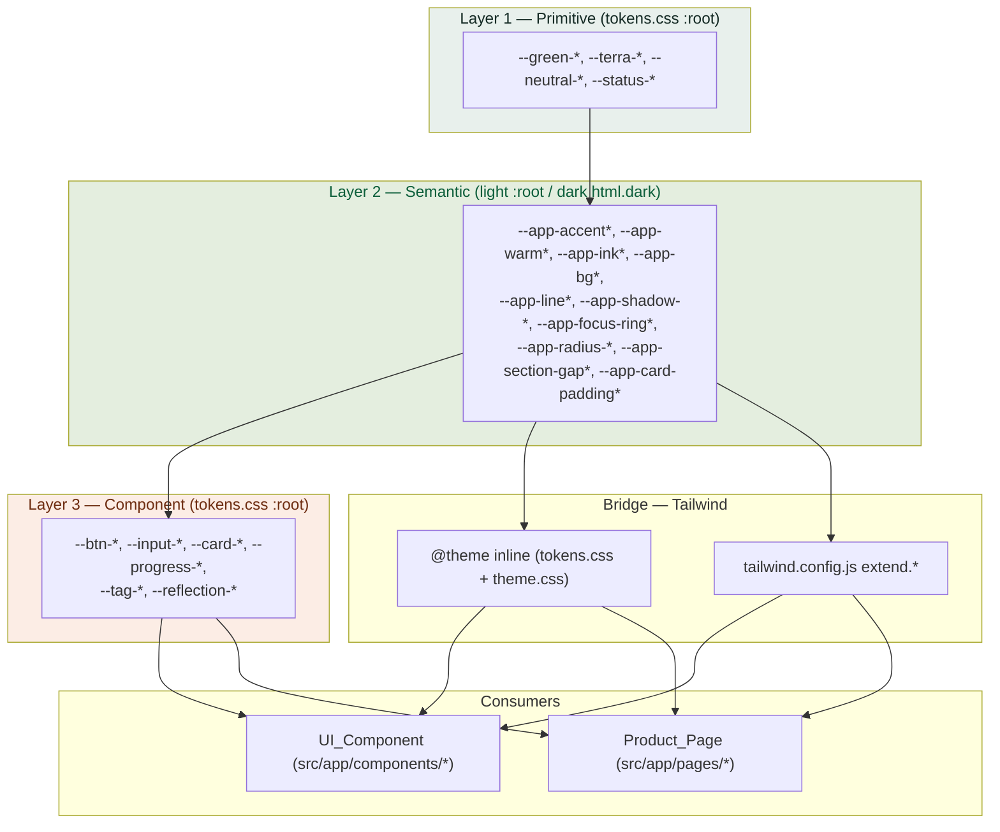

# Design Document

## Overview

Tính năng **global-ui-upgrade** nâng cấp chất lượng thị giác toàn bộ Vision Board Web Platform theo hướng **elevate** (tinh chỉnh phong cách hiện có), KHÔNG thiết kế lại. Trọng tâm kỹ thuật là **củng cố hệ design token 3 lớp** làm nguồn duy nhất cho mọi quyết định thị giác, **loại bỏ color drift** khỏi bản sắc Forest Green / Terracotta, và **đồng bộ typography, spacing, radius, elevation, motion** trên toàn bộ Product_Page ở cả light + dark mode — trong khi **đóng băng và bảo toàn contract Core** (entitlement / route / auth / sync / copy theo App_Mode).

Đây là bề mặt **Mixed/Shell**: phần lớn thay đổi nằm ở tầng trình bày (`src/styles/*`, `src/app/components/*`, `src/app/pages/*`), nhưng vì có thể chạm tới copy real-mode và điều kiện gate route nên phải xử lý theo quy tắc Mixed: **freeze Core contract trước, iterate Shell sau**.

### Nghiên cứu và phát hiện từ codebase hiện tại

Khảo sát trực tiếp mã nguồn để design bám sát thực tế:

1. **Hệ token 3 lớp đã tồn tại** trong `src/styles/tokens.css`:
   - Layer 1 Primitive: `--green-*`, `--terra-*`, `--neutral-*`, `--status-*`.
   - Layer 2 Semantic (light) trong `:root`, dark override trong `html.dark`: `--app-accent*`, `--app-warm*`, `--app-ink*`, `--app-bg*`, `--app-line*`, `--app-shadow-*`, `--app-focus-ring*`, `--app-radius-*`, `--app-section-gap*`, `--app-card-padding*`.
   - Layer 3 Component: `--btn-*`, `--input-*`, `--card-*`, `--progress-*`, `--tag-*`, `--reflection-*`.
   - Cầu nối Tailwind qua `@theme inline` (trong `tokens.css` và `theme.css`) và `tailwind.config.js` (`extend.colors`, `fontFamily`, `borderRadius`, `boxShadow`, `spacing`).

2. **Motion + typography scale + Radix/shadcn base** nằm trong `src/styles/theme.css`: `--duration-*` (150–500ms), `--ease-*`, `--shadow-1..5`, thang `--text-xs..--text-display` kèm `--*--line-height`, và các token base (`--primary`, `--ring`, `--destructive`…) đã được ánh xạ về `--app-accent` / green-tinted (không còn tím `#7c3aed` ở tầng base).

3. **Color_Drift còn sót lại** (xác nhận bằng grep, cần đưa vào phạm vi elevate):
   - `theme.css`: `.ambient-glow::before/::after` dùng tím/indigo `rgba(124, 58, 237, …)`, `rgba(99, 102, 241, …)`; `.glass-surface-gradient-border` dùng gradient xanh dương/cyan `rgba(37, 99, 235, …)`, `rgba(8, 145, 178, …)`; còn các literal `#7c3aed`, `#2563eb`, `.dark .bg-violet-600` rải rác.
   - `tokens.css`: các `--color-*-accent` (life areas) hard-code xanh dương/tím/cyan (`#2563eb`, `#7c5cfc`, `#2ba8e0`…) — thuộc palette phân loại lĩnh vực, cần đánh giá riêng: giữ ngữ nghĩa phân biệt lĩnh vực nhưng kéo về hài hòa với Brand_Identity khi dùng làm accent trang trí.

4. **Chú thích lệch giá trị thực thi** (Requirement 2.5): `tailwind.config.js` ghi `card 14px`, `control 11px` nhưng `tokens.css` thực thi `--app-radius-card: 18px`, `--app-radius-control: 12px`; comment thang typography trong `theme.css` nói "Heading uses font-serif (Source Serif 4)" trong khi `--app-font-serif` là `"Bricolage Grotesque"` và `fonts.css` chỉ `@import` Source Serif 4. Đây là drift tài liệu cần đồng bộ.

5. **Hạ tầng PBT đã có sẵn** trong `src/test/ux-ui-upgrade/`: `token-parser.ts` (parse `tokens.css` → TokenSet + ReferenceGraph, `resolveToken`, `classifyLayer`), `contrast.ts` (tính Contrast_Ratio WCAG), cùng `property-1..9-*.test.ts`. Feature này **kế thừa và mở rộng** hạ tầng đó thay vì dựng mới — nhất quán với Engineering Rules ("prefer existing helpers").

> Ghi chú phạm vi: hạ tầng test hiện có gắn tag `Feature: ux-ui-upgrade`. Spec này mang tên `global-ui-upgrade`; các property mới sẽ dùng tag `Feature: global-ui-upgrade` nhưng tái sử dụng cùng bộ helper (`token-parser`, `contrast`) để tránh trùng lặp công cụ.

### Mục tiêu thiết kế

- Mọi UI_Component / Product_Page chỉ tham chiếu Semantic_Token hoặc Component_Token (không Primitive trực tiếp, không literal drift).
- Mọi Semantic_Token thị giác định nghĩa cho light mode đều có override tương ứng cho dark mode.
- Thang typography, spacing, radius, elevation, motion là nguồn duy nhất và được áp dụng nhất quán.
- Accessibility: body text ≥ 4.5:1, non-text/focus ≥ 3:1, tôn trọng `prefers-reduced-motion`.
- Core behavior (entitlement/route/auth/sync/copy mode) không đổi.

### Phi mục tiêu (Non-goals)

- Không đổi tên bất kỳ Design_Token nào (chỉ đổi giá trị khi cần — Requirement 1.3).
- Không thay họ màu/font sang phong cách khác (Requirement 1.2, 1.5).
- Không thay đổi schema/key localStorage, contract API, logic entitlement, tập route.
- Không refactor logic nghiệp vụ; chỉ chạm tầng trình bày.

## Architecture

### Kiến trúc hệ Design_System 3 lớp

Luồng phụ thuộc token là **một chiều**: Component chỉ đọc Semantic; Semantic chỉ đọc Primitive; JSX/CSS component chỉ đọc Semantic hoặc Component.



**Nguyên tắc bất biến (invariants) của kiến trúc:**

- I1 — **Hướng tham chiếu**: Semantic → {Primitive, Semantic}; Component → {Primitive, Semantic}; không token nào tham chiếu Component (Component là lớp đỉnh). Đồ thị `var()` acyclic và mọi chuỗi kết thúc tại literal Primitive.
- I2 — **Chỉ Semantic/Component ở tầng tiêu thụ**: JSX/CSS component không tham chiếu Primitive trực tiếp, không literal màu drift.
- I3 — **Dark parity**: mỗi Semantic_Token thị giác trong light có override trong `html.dark`.
- I4 — **Phân vùng ngữ cảnh màu**: `--app-warm*` / `--reflection-*` / `--app-focus-ring-warm` chỉ được dùng ở vai trò **accent/brand** trong Reflection_Context; Execution/Goal/Plan không dùng warm làm accent/brand. Tuy nhiên, khi token warm phục vụ vai trò **affordance nguy hiểm/cảnh báo/lỗi/trạng thái** (danger/warning/error/status) thì được phép dùng ở bất kỳ đâu trong app — vai trò này khác biệt với accent/brand.

### Theme_Engine (light/dark)

`Theme_Engine` chuyển chế độ bằng class `dark` trên phần tử gốc (`html.dark` cho tokens.css, `.dark` cho theme.css qua `@custom-variant dark (&:is(.dark *))`). Component không cần biết đang ở chế độ nào — chỉ đọc Semantic_Token, còn giá trị được `Theme_Engine` chọn theo cascade. Design không thay đổi cơ chế này; chỉ đảm bảo **đầy đủ override** (I3) để mọi nâng cấp light có tương đương dark.

### Ranh giới Core (đóng băng) vs Shell (nâng cấp)

```mermaid
flowchart LR
    subgraph FROZEN["Core — ĐÓNG BĂNG (không đổi)"]
      F1["usePlanEntitlements, UpgradePaywallDialog"]
      F2["routes.tsx + điều kiện gate theo App_Mode"]
      F3["auth flows (signup/signin/reset/verify)"]
      F4["localStorage schema/keys"]
      F5["sync state (synced/syncing/offline/error)"]
      F6["copy branching isRealMode()/isDemoMode()"]
    end
    subgraph SHELL["Shell — NÂNG CẤP (elevate)"]
      SH1["tokens.css / theme.css / tailwind.config.js / fonts.css"]
      SH2["UI_Component styling (giữ nguyên props/API)"]
      SH3["Product_Page presentation"]
    end
    SHELL -. "chỉ đọc, không sửa" .-> FROZEN
```



Quy tắc Mixed: mọi thay đổi Shell **không được** làm biến đổi hành vi trong khối FROZEN. Khi một chuỗi copy được chỉnh trong lúc polish, phải giữ nguyên nhánh `isRealMode()` / `isDemoMode()` (Requirement 10.3) và không để lộ copy demo trong real mode (Requirement 10.1).

### Chiến lược loại bỏ Color_Drift

Quy trình 3 bước cho mỗi drift:

1. **Phát hiện**: quét literal màu ngoài Brand_Identity (tím `#7c3aed`/`#7c5cfc`/`rgba(124,58,237,…)`, indigo `rgba(99,102,241,…)`, xanh dương/cyan `#2563eb`/`rgba(37,99,235,…)`/`rgba(8,145,178,…)`, `bg-violet-*`) trong `src/styles/*` và `src/app/**`.
2. **Ánh xạ theo ngữ cảnh**: thay bằng Semantic_Token phù hợp — vùng Execution/trung tính → họ `--app-accent*` (Forest Green); vùng Reflection → họ `--app-warm*` (Terracotta); trang trí nền → gradient thương hiệu có sẵn (`--grad-aspire`, `--grad-vision`, `--gradient-forest`…).
3. **Xác minh**: chạy PBT color-context + token-integrity để đảm bảo không còn literal drift và ngữ cảnh warm/accent đúng.

Trường hợp đặc biệt — **life-area accents** (`--color-*-accent`): đây là palette phân biệt lĩnh vực (career/finance/health…) có ngữ nghĩa riêng, không phải drift thuần túy. Design giữ nguyên vai trò phân loại nhưng: (a) không dùng chúng làm accent hành động/thương hiệu, (b) đánh giá contrast từng giá trị ở cả hai mode, (c) nếu một giá trị phá vỡ sự hài hòa editorial, tinh chỉnh sắc độ về phía trầm hơn mà **giữ nguyên tên token**.

## Components and Interfaces

Feature không thêm React component hay API mới. "Interface" ở đây là **hợp đồng token** và các **contract kiểm thử** mà tầng trình bày phải tuân thủ.

### 1. Token contract (nguồn: `src/styles/tokens.css`, `theme.css`)

| Nhóm | Semantic/Component token (ví dụ) | Quy tắc tiêu thụ |
|---|---|---|
| Màu nền/chữ/line | `--app-bg`, `--app-surface`, `--app-ink`, `--app-ink-soft`, `--app-line`, `--app-line-strong` | Component đọc trực tiếp hoặc qua Tailwind `bg-app-*`, `text-app-*` |
| Accent (Execution) | `--app-accent`, `--app-accent-hover`, `--app-accent-soft`, `--app-accent-subtle` | Dùng ở mọi vùng trừ Reflection |
| Warm (Reflection) | `--app-warm`, `--reflection-*`, `--app-focus-ring-warm` | CHỈ Reflection_Context |
| Typography | `--text-xs … --text-display` + `--*--line-height` | Dùng qua `text-*` utility hoặc `font-size: var(--text-*)` |
| Spacing | `--app-section-gap`, `--app-section-gap-compact`, `--app-card-padding`, `--app-card-padding-mobile` | Section gap + card padding |
| Radius | `--app-radius-card`, `--app-radius-input`, `--app-radius-control`, `--app-radius-pill` | Theo loại phần tử |
| Elevation | `--app-shadow-sm … --app-shadow-xl`, `--shadow-1 … --shadow-5` | Theo mức nổi khối |
| Motion | `--duration-*` (150–500ms), `--ease-*` | Mọi transition/animation |
| Focus | `--app-focus-ring`, `--app-focus-ring-warm` | Keyboard focus indicator |
| Component | `--btn-*`, `--input-*`, `--card-*`, `--progress-*`, `--tag-*`, `--reflection-*` | Pattern tái sử dụng |

**Bất biến API component (Requirement 5.5):** khi nâng polish, giữ nguyên tên props, kiểu props và hành vi của UI_Component; chỉ thay đổi giá trị style/token bên trong.

### 2. Tailwind bridge contract (`@theme inline`, `tailwind.config.js`)

- Mỗi utility màu/shape/shadow ánh xạ tới đúng một Semantic_Token qua `var(...)`.
- Chú thích trong `tailwind.config.js` phải khớp giá trị thực thi trong `tokens.css` (Requirement 2.5): cập nhật comment `card 14px → 18px`, `control 11px → 12px`.

### 3. Contract kiểm thử hiện có cần giữ xanh (Requirement 11.3)

- `token-parser.ts` / `token-scan.ts` / `calm-style-scan.ts`: quét token & style drift.
- `contrast.ts`: tính Contrast_Ratio.
- `core-flow-*.test.tsx`, `reflection-layout-contract`, `empty-state-contract`, `focus-keyboard`, `reduced-motion`, `mobile-safety-touch-target`, `destructive-dialog-realmode-gating`, `no-window-confirm-runtime`, `public-legal-demo-copy`.

### 4. Core helper (chỉ đọc, không sửa)

- `isRealMode()` / `isDemoMode()` (`src/app/utils`): dùng để giữ nhánh copy/route.
- `usePlanEntitlements`, `UpgradePaywallDialog`: entitlement/paywall.
- Storage modules (`storage.ts`, `storage-types.ts`, `storage-twelve-week.ts`): schema/key bất biến.

## Data Models

Feature không tạo hay đổi mô hình dữ liệu nghiệp vụ (localStorage/API/entitlement đóng băng). Các "mô hình" dưới đây là **mô hình dữ liệu của hệ token và của các kiểm thử** — nền tảng để phát biểu correctness properties.

### Token model (từ `token-parser.ts`)

```
Layer       = "primitive" | "semantic" | "component"
Mode        = "light" | "dark"
TokenName   = string                       // ví dụ "--app-accent"
TokenValue  = string                       // literal hoặc chứa var(--x)
TokenSet    = Map<TokenName, TokenValue>   // theo từng Mode
ReferenceGraph = Map<TokenName, TokenName[]>  // cạnh A→B nếu value(A) chứa var(B)
ResolvedToken  = { name: TokenName; resolvedValue: string }  // không còn "var("
```

Hàm chuẩn: `loadTokenSet({mode})`, `buildReferenceGraph(set)`, `classifyLayer(name)`, `resolveToken(name, set)`.

### Contrast model (từ `contrast.ts`)

```
RGB           = { r: number; g: number; b: number }
ContrastRatio = number                     // 1.0 … 21.0 theo WCAG 2.1
TextSample    = { fg: TokenName; bg: TokenName; mode: Mode }  // cặp cần kiểm ≥4.5:1
NonTextSample = { fg: TokenName; bg: TokenName; mode: Mode }  // cặp cần kiểm ≥3:1
```

### Typography scale model

```
TypeTier = "xs"|"sm"|"base"|"lg"|"xl"|"2xl"|"3xl"|"4xl"|"5xl"|"display"
TierSpec = { size: var(--text-<tier>); lineHeight: var(--text-<tier>--line-height) }
```

Bất biến: body tiers (`base`, `sm`) có `line-height` ≥ 1.45 (Requirement 3.2).

### Motion model

```
DurationToken = "--duration-instant"|"--duration-fast"|"--duration-base"|"--duration-medium"|"--duration-slow"|"--duration-slower"
EaseToken     = "--ease-emphasized"|"--ease-standard"|"--ease-decelerate"|"--ease-accelerate"|"--ease-spring"|"--ease-overshoot"
```

Bất biến: mọi `DurationToken` dùng chung resolve về giá trị trong [150ms, 500ms] (Requirement 8.2).

### Color-context model

```
Context   = "execution" | "reflection" | "neutral"
Role      = "accent" | "status"                // vai trò tiêu thụ token warm
warmTokens = { --app-warm*, --reflection-*, --app-focus-ring-warm }
// warm ở Role = accent chỉ hợp lệ khi Context = reflection
// warm ở Role = status (danger/warning/error/status) hợp lệ ở mọi Context
```

Bất biến: file/khối thuộc Execution/Neutral không tham chiếu `warmTokens` ở vai trò accent/brand; vai trò status (danger/warning/error) được phép app-wide (Requirement 1.4).

## Correctness Properties

*Một property là một đặc tính hoặc hành vi phải đúng trên mọi lần thực thi hợp lệ của hệ thống — về bản chất là một phát biểu hình thức về những gì hệ thống phải làm. Property là cầu nối giữa đặc tả cho người đọc và bảo đảm đúng đắn kiểm chứng được bằng máy.*

Các property dưới đây được suy ra từ prework (đã qua bước reflection để loại trùng lặp). Nhóm "chống drift ở tầng tiêu thụ" (2.2, 2.4, 3.4, 4.4, 5.1, 6.4, 8.1, 8.4) được gộp thành **Property 2** — một bất biến tổng quát trên mọi file consumer. Mỗi property gắn với hạ tầng PBT hiện có (`token-parser.ts`, `contrast.ts`) và chạy tối thiểu 100 iterations.

### Property 1: Bảo toàn tên token và bất biến cấu trúc 3 lớp

*For any* Design_Token có trong baseline, tên (key) của nó vẫn tồn tại trong hệ token hiện tại (tập tên là superset của baseline — không xóa, không đổi tên); và *for any* token trong hệ hiện tại, hướng tham chiếu của nó hợp lệ (Semantic → {Primitive, Semantic}; Component → {Primitive, Semantic}; không token nào tham chiếu một Component_Token), đồ thị `var()` không có chu trình, và mọi chuỗi `var()` kết thúc tại một literal Primitive sau hữu hạn bước.

**Validates: Requirements 1.3, 2.1**

### Property 2: Tầng tiêu thụ chỉ dùng token, không literal giá trị dùng chung

*For any* file thuộc tầng tiêu thụ (`src/app/components/**`, `src/app/pages/**`) và các khối style component, không tồn tại literal giá trị thị giác dùng chung trùng với một token đã định nghĩa — bao gồm: không tham chiếu Primitive_Token trực tiếp (`--green-*`, `--terra-*`, `--neutral-*`), không màu hex/rgb đơn-mode trùng token, không `font-size`/`line-height` trùng một bậc thang typography, không `px` spacing/radius trùng token spacing/radius, không `box-shadow` literal trùng token elevation, và không `duration`/`easing` literal trùng token motion; mọi giá trị dùng chung phải tham chiếu Semantic_Token hoặc Component_Token.

**Validates: Requirements 2.2, 2.4, 3.4, 4.4, 5.1, 6.4, 8.1, 8.4**

### Property 3: Không còn Color_Drift ngoài Brand_Identity

*For any* file trong `src/styles/**` và `src/app/**`, không xuất hiện literal màu nằm ngoài bảng màu Brand_Identity (tím `#7c3aed`/`#7c5cfc`/`rgba(124,58,237,…)`, indigo `rgba(99,102,241,…)`, xanh dương/cyan `#2563eb`/`rgba(37,99,235,…)`/`rgba(8,145,178,…)`, tiện ích `bg-violet-*`); mọi nhu cầu màu trang trí được biểu diễn bằng token thuộc họ Forest Green hoặc Terracotta phù hợp ngữ cảnh.

**Validates: Requirements 2.3**

### Property 4: Phân vùng ngữ cảnh màu (warm chỉ trong Reflection)

*For any* file/khối style không thuộc Reflection_Context (Execution / Goal / Plan / Neutral), không tham chiếu bất kỳ token warm nào (`--app-warm*`, `--reflection-*`, `--app-focus-ring-warm`) **ở vai trò accent/brand**; token warm phục vụ vai trò affordance nguy hiểm/cảnh báo/lỗi/trạng thái (danger/warning/error/status) được phép dùng trên toàn app (khác biệt với vai trò accent/brand). Reflection_Context vẫn là nơi duy nhất token warm được dùng ở vai trò brand/accent (tone thương hiệu).

Ghi chú kiểm thử: test của P4 sử dụng một allowlist ở cấp file (được tài liệu hóa) liệt kê các surface dùng warm-as-status, để phân biệt với vi phạm warm-as-accent.

**Validates: Requirements 1.4**

### Property 5: Dark mode parity cho mọi Semantic_Token thị giác

*For any* Semantic_Token thị giác được định nghĩa trong light mode (`:root`), tồn tại một giá trị override tương ứng trong dark mode (`html.dark`), sao cho khi `Theme_Engine` bật class `dark` thì token đó resolve về giá trị dark hợp lệ (không rơi về giá trị light).

**Validates: Requirements 6.1, 6.3**

### Property 6: Contrast văn bản nội dung ≥ 4.5:1

*For any* cặp (token màu chữ nội dung, token màu nền hợp lệ của nó) và *for any* mode ∈ {light, dark}, Contrast_Ratio giữa chữ và nền ≥ 4.5:1.

**Validates: Requirements 7.1**

### Property 7: Contrast thành phần phi văn bản và focus ring ≥ 3:1

*For any* cặp (token thành phần nhận-biết-phi-văn-bản — border control `--app-line-strong`, icon trạng thái `--app-status-*`, màu focus ring `--app-focus-ring`/`--app-focus-ring-warm`; nền liền kề) và *for any* mode ∈ {light, dark}, Contrast_Ratio ≥ 3:1.

**Validates: Requirements 7.2, 7.3**

### Property 8: Thang typography đơn điệu

*For any* cặp bậc typography liền kề (tier_n, tier_n+1) theo thứ tự `xs → sm → base → lg → xl → 2xl → 3xl → 4xl → 5xl → display`, giá trị `--text-<tier_n>` ≤ `--text-<tier_n+1>` (thang không đảo bậc).

**Validates: Requirements 3.1**

### Property 9: Line-height văn bản nội dung ≥ 1.45

*For any* bậc typography dành cho văn bản nội dung (body: `base`, `sm`), giá trị `--text-<tier>--line-height` ≥ 1.45 (để dấu tiếng Việt không chồng lấn).

**Validates: Requirements 3.2**

### Property 10: Thời lượng transition dùng chung trong [150ms, 500ms]

*For any* token thời lượng `--duration-*` dùng cho transition/animation dùng chung, giá trị resolve nằm trong khoảng [150ms, 500ms].

**Validates: Requirements 8.2**

### Property 11: Bảo toàn key localStorage

*For any* storage key có trong baseline, key đó vẫn tồn tại nguyên vẹn trong hệ hiện tại (không đổi tên, không thay đổi hình dạng dữ liệu đã lưu); không có thay đổi nào của nâng cấp UI làm biến mất hoặc đổi tên một storage key baseline.

**Validates: Requirements 9.4**

### Property 12: Ánh xạ trạng thái sync sang chỉ báo UI phân biệt được

*For any* trạng thái sync ∈ {synced, syncing, offline, error} cho người dùng real-mode đã đăng nhập, hệ thống render một chỉ báo trạng thái phân biệt được ứng với đúng trạng thái đó (ánh xạ đơn ánh state → biểu diễn UI).

**Validates: Requirements 9.5**

### Property 13: Real mode không lộ copy demo-only

*For any* chuỗi copy được render khi `App_Mode` là `real`, chuỗi đó không chứa cụm từ chỉ dành cho demo ("dùng thử", "trên trình duyệt này", "không thu tiền thật", "mock", "demo").

**Validates: Requirements 10.1**

## Error Handling

Vì đây là bề mặt trình bày, "lỗi" chủ yếu là **drift/regression** phát hiện ở thời điểm build/test, cùng vài lỗi runtime liên quan token và theme.

### Lỗi phân giải token (token resolution failure)

- **Triệu chứng**: một `var(--x)` không phân giải được (token thiếu ở một mode, hoặc chuỗi tham chiếu gãy).
- **Xử lý thiết kế**: mọi Semantic_Token luôn có fallback resolve về Primitive; dark override đầy đủ (Property 5) ngăn token rơi về giá trị sai mode. Test `token-resolution-failure.test.ts` phải luôn xanh; nếu một token mới thêm mà thiếu override dark, coi là lỗi cần sửa trước khi hoàn tất (Requirement 11.2).
- **Nguyên tắc**: không "vá" bằng literal màu — phải bổ sung token đúng lớp.

### Drift màu / hard-code (compile-time guard)

- Phát hiện bởi Property 2, 3, 4 và các scan (`calm-style-scan`, `token-scan`). Khi test drift fail, output chỉ ra file + literal vi phạm; sửa bằng cách ánh xạ về token đúng ngữ cảnh (accent vs warm).

### Contrast không đạt

- Nếu Property 6/7 fail cho một cặp fg/bg, điều chỉnh **giá trị** token (giữ nguyên tên — Requirement 1.3) cho tới khi đạt ngưỡng, ưu tiên chỉnh Primitive/Semantic thay vì thêm ngoại lệ cục bộ. Ghi lại lý do chỉnh sắc độ trong comment token.

### Reduced-motion

- Khi `prefers-reduced-motion: reduce`, animation không thiết yếu phải bị giảm/tắt qua media query toàn cục; component không tự ý bật animation bỏ qua media query. Lỗi ở đây là animation vẫn chạy khi user tắt motion → `reduced-motion.test.tsx` bắt được.

### Rò rỉ copy demo trong real mode

- Property 13 + `public-legal-demo-copy.test.ts` chặn ở test-time. Khi chỉnh copy lúc polish, luôn giữ nhánh `isRealMode()/isDemoMode()`; nếu vô tình đưa cụm demo vào nhánh dùng chung, test fail và chỉ ra chuỗi vi phạm.

### Bảo toàn Core (fail-safe)

- Mọi thay đổi Shell không được sửa entitlement/route/auth/storage/sync. Nếu một thay đổi trình bày vô tình chạm khối FROZEN (ví dụ đổi key storage, bỏ gate route), các test Core hiện có (routes.test, entitlement, storage-keys, sync-mapping) fail — đây là hàng rào an toàn, phải khôi phục hành vi Core trước khi tiếp tục.

## Testing Strategy

### Cách tiếp cận kép

- **Property tests (PBT)**: kiểm các bất biến phổ quát của hệ token, contrast, dark parity, phân vùng màu, typography scale, motion range, bảo toàn key/copy — chạy tối thiểu **100 iterations** mỗi property.
- **Unit / DOM tests (example, edge, integration nhẹ)**: kiểm hành vi cụ thể không phổ quát — hover/focus/disabled state, page transition, toggle dark tại DOM, gate route theo mode, rẽ nhánh copy real/demo, reduced-motion qua `matchMedia`.
- **Smoke / regression gate**: chạy lại bộ contract hiện có và các bước xác minh frontend.

### Thư viện và hạ tầng

- PBT: **fast-check** + **Vitest** (đã dùng trong `src/test/ux-ui-upgrade/`). KHÔNG tự viết PBT từ đầu.
- Tái sử dụng helper hiện có: `token-parser.ts` (`loadTokenSet`, `buildReferenceGraph`, `classifyLayer`, `resolveToken`), `contrast.ts` (Contrast_Ratio), `baseline.ts` (tên token & storage key baseline), các `*-scan.ts`.
- Mỗi property test gắn tag comment: **`Feature: global-ui-upgrade, Property {number}: {property_text}`**.
- Cấu hình `fc.assert(..., { numRuns: 100 })` (hoặc lớn hơn) cho mọi property.

### Ánh xạ property → chiến lược test

| Property | Nguồn dữ liệu / cơ chế | Loại |
|---|---|---|
| P1 Token names + 3-layer | `token-parser` trên baseline + current, DFS acyclic, resolve termination | PBT |
| P2 Consumer không literal | scan file `src/app/**` + regex token-vs-literal | PBT |
| P3 Không color drift | scan `src/styles/**` + `src/app/**` tập literal drift | PBT |
| P4 Phân vùng warm | classify context theo path/khối, kiểm tham chiếu warm | PBT |
| P5 Dark parity | so tập semantic light vs dark override | PBT |
| P6 Contrast ≥4.5 | `contrast.ts` trên cặp ink/bg × mode | PBT |
| P7 Contrast ≥3 non-text/focus | `contrast.ts` trên cặp affordance/focus × mode | PBT |
| P8 Thang đơn điệu | resolve `--text-*`, so cặp liền kề | PBT |
| P9 Line-height ≥1.45 | resolve `--text-*--line-height` body | PBT |
| P10 Duration ∈ [150,500] | resolve `--duration-*` | PBT |
| P11 Storage keys | `storage-keys-scan` vs baseline | PBT |
| P12 Sync mapping | render mỗi sync state → chỉ báo | PBT |
| P13 Real-mode copy | render copy real mode, quét cụm demo | PBT |
| 1.1/1.2 brand color/font | assert token màu/font (example cố định) | Unit |
| 2.5 comment ↔ value | parse comment radius vs resolve token | Unit |
| 3.3/4.3 nhất quán trang | render nhóm trang/component cùng loại | DOM |
| 5.2/5.3/5.4 hover/focus/disabled | CSS state + DOM focus | DOM |
| 6.2 toggle dark | toggle `.dark`, computed style | DOM |
| 7.4 reduced-motion | `matchMedia(prefers-reduced-motion)` | DOM |
| 8.3 page transition | class `page-enter` dùng token motion | DOM |
| 9.2/10.2/10.3 route+copy mode | route registration & copy branch theo mode | DOM |

### Cân bằng unit vs property

- Không viết quá nhiều unit test cho những gì property đã phủ (property lo phần "mọi input"). Unit/DOM chỉ tập trung vào ví dụ cụ thể, điểm tích hợp, edge case, và hành vi state không phổ quát.
- Edge cases (chuỗi copy có unicode/dấu tiếng Việt, token thiếu ở một mode, cặp fg/bg biên) được xử lý bằng generator của property tương ứng.

### Regression gate (Requirement 11)

Sau khi hoàn tất một bề mặt, chạy — chọn tập nhỏ nhất liên quan trước, mở rộng nếu bề mặt dùng chung:

```bash
npm run typecheck
npm run lint
npm run test:run
npm run build
```

Dùng `npm run check` khi thay đổi ảnh hưởng rộng. Giữ các contract test hiện có tiếp tục xanh (`reflection-layout-contract`, `empty-state-contract`, a11y, `focus-keyboard`, `reduced-motion`, `destructive-dialog-realmode-gating`, `no-window-confirm-runtime`, `public-legal-demo-copy`). Nếu một bước fail do nâng cấp, sửa nguyên nhân gốc trước khi coi bề mặt là hoàn tất (Requirement 11.2).
