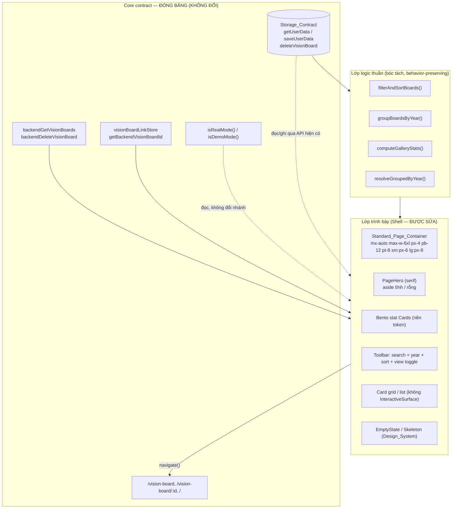

# Design Document — Library Page UI Alignment

## Overview

Tài liệu thiết kế này mô tả cách căn chỉnh giao diện trang Thư viện (`VisionBoardGallery`, route `/gallery`, eyebrow "Thư viện Bản vẽ Tương lai") cho đồng bộ với hệ thống thiết kế chung của trang web, **mà không** thay đổi bất kỳ hành vi dữ liệu, storage shape, luồng sync, điều hướng, logic lọc/sắp xếp/thống kê hay nhánh branching theo App_Mode nào.

Phân loại theo Hybrid SDD/ADD: đây là công việc **Shell** thuần trên một **side surface** (vision board). Không chạm Core contract (Storage_Contract, Entitlement_Authority, sync semantics, route availability, `isRealMode()`/`isDemoMode()` branching). Vì vậy nguyên tắc chủ đạo là:

1. **Chỉ sửa lớp trình bày.** Mọi thay đổi giới hạn ở `className`/Tailwind, cấu trúc JSX layout, component dùng chung được render, token màu/spacing/radius. Không đụng tới các nhánh đọc/ghi dữ liệu, gọi backend, link store, hay tính toán stats/lọc/sắp xếp.
2. **Tái sử dụng, không tạo abstraction trình bày mới.** Trang đã dùng `PageHero`, `Card`, `EmptyState`, `Button`, `Badge`, `Skeleton`. Việc căn chỉnh là gỡ bỏ các lớp trang trí ngoài hệ thống và để các component dùng chung tự lo phần trình bày chuẩn.
3. **Bóc tách logic thuần để kiểm chứng.** Logic lọc/sắp xếp/gom nhóm/stats hiện nằm inline trong component qua `useMemo`. Thiết kế đề xuất **bóc tách bảo toàn hành vi** (behavior-preserving extraction) các hàm thuần này ra một module selector, để vừa giữ nguyên kết quả (Req 10) vừa cho phép property-based testing khẳng định "hành vi dữ liệu không đổi".
4. **Calm_Style tuyệt đối.** Không glow, không 3D transform, không motion > 300ms, không loop/autoplay, không `hover:scale-*`. Đây là cùng quy ước đã chuẩn hoá ở spec `core-flow-ui-upgrade` (Requirement 10).

### Các Decorative_Layer cần gỡ bỏ

Bảng dưới liệt kê chính xác từng phần tử trang trí ngoài hệ thống hiện có trong `VisionBoardGallery.tsx` và hướng xử lý:

| Decorative_Layer hiện tại | Vị trí | Xử lý |
|---------------------------|--------|-------|
| Container gradient nhiều tầng (`bg-gradient-to-br from-app-bg via-app-bg-subtle/50 to-app-accent-subtle/30 ...`) + `border`/`shadow-app-sm`/`min-h-[600px]`/`animate-fade-in` bọc toàn trang | `<div>` gốc của trang | Thay bằng Standard_Page_Container `mx-auto max-w-6xl px-4 pb-12 pt-8 sm:px-6 lg:px-8` + `stack-section`, bỏ mọi lớp gradient/border/shadow/min-height bọc ngoài |
| Aurora orbs nền `blur-[120px]` (2 orb `bg-app-accent/5`, `bg-app-warm/5`) | Khối "Background Aurora Orbs" | Xoá toàn bộ khối `<div className="absolute inset-0 ...">` chứa orbs, và wrapper `relative z-10` không còn cần thiết |
| Mockup 3D `Gallery3DHeroMockup` (`[perspective:1000px]`, `translateZ`, `rotate`, tape, `blur-2xl`, `hover:scale-110`, `hover:z-20`) | `aside` của `PageHero` | Xoá component `Gallery3DHeroMockup`; thay bằng `aside` tĩnh Calm_Style (illustration `VisionMapIllustration` tĩnh) hoặc bỏ trống `aside` |
| Gradient chữ tiêu đề (`bg-gradient-to-r from-app-accent via-emerald-600 to-app-warm bg-clip-text text-transparent`) | `title` của `PageHero` | Thay cụm nhấn mạnh bằng `text-app-accent` (token màu chữ), bỏ gradient chữ |
| `InteractiveSurface` nghiêng 3D (`intensity`, `translate`) bọc mỗi thẻ board | Grid theo năm + grid phẳng | Xoá `InteractiveSurface`, render `Card` trực tiếp |
| `animate-pulse` trên icon `Sparkles` (stat card "Tổng phần tử") | Card 3 Bento | Xoá `animate-pulse` |
| `hover:scale-*` / `group-hover:scale-*` / `group-hover:rotate-12` / `group-hover:translate-y` | PageHero CTA, Bento cards, collage, overlay | Thay bằng phản hồi tĩnh theo token (`hover:bg-*`, `hover:border-*`, `hover:shadow-app-*`) |
| Bento card gradient nền (`bg-gradient-to-br from-app-accent-subtle/80 to-app-surface`, `from-app-warm-subtle/80`, `from-blue-50/60`) | 4 Bento stat cards | Thay bằng nền token `bg-app-surface` (viền + shadow token cho phân tách) |
| Màu ngoài token (`blue-600/400`, `amber-500`, `indigo-500`, `purple-500`, `pink-500`, `teal-500`, `emerald-500`, `bg-white`, `text-white` overlay) | Bento cards, biểu đồ phân bổ, overlay hover thẻ | Thay bằng token: chart categories dùng `--chart-*`/`app-accent`/`app-warm`/`app-status-info`; overlay dùng token surface/ink |
| Overlay hover `bg-black/40 backdrop-blur-[3px]` + action trồi lên | Preview thẻ board | Thay bằng hàng action tĩnh (luôn hiển thị hoặc hiện khi hover/focus bằng đổi opacity ≤ 300ms, không blur, không dịch chuyển 3D) |
| Tape/`backdrop-blur` trong `BoardCollagePreview` | Preview collage | Gỡ tape + backdrop-blur trang trí; giữ ảnh polaroid ở dạng tĩnh theo token (bỏ `-rotate-6`/`group-hover:scale-105`) |

### Hai lớp của thiết kế

- **Lớp logic thuần (testable)**: các selector thuần bóc tách từ component — `filterAndSortBoards`, `groupBoardsByYear`, `computeGalleryStats`, `resolveGroupedByYear`. Đây là nơi áp dụng property-based testing để chứng minh hành vi dữ liệu **không đổi**.
- **Lớp trình bày (UI)**: layout/spacing/typography/color-token/motion/empty-loading/a11y. Kiểm chứng bằng DOM assertion, snapshot, kiểm thử ví dụ, và property test "không xuất hiện lớp trang trí bị cấm / không dùng màu ngoài token" trên markup render với dữ liệu sinh ngẫu nhiên.

## Architecture

### Sơ đồ ranh giới Shell / Core



### Phạm vi được phép sửa

| Vùng | Được phép sửa | Bị đóng băng |
|------|---------------|--------------|
| Container / layout | className container, spacing, radius token, bỏ gradient/orbs | — |
| Hero | dùng `PageHero`, đổi `aside`, bỏ gradient chữ | eyebrow/title/description/CTA nội dung & đích điều hướng |
| Stats Bento | nền/màu/shadow theo token, bỏ animate-pulse/scale | công thức tính `stats`, điều kiện hiển thị |
| Toolbar | radius/viền/màu focus theo token, nhãn a11y | state `searchTerm/selectedYear/sortBy/viewMode`, logic lọc |
| Thẻ board | bỏ `InteractiveSurface`, overlay tĩnh, màu token | `navigate` đích, spotlight, chỉ báo sync |
| Empty/Loading | `EmptyState`/`Skeleton` Design_System | điều kiện rỗng/lọc-rỗng, `VisionBoardGallerySkeleton` gate |
| Selector logic | **chỉ bóc tách nguyên trạng** ra module thuần | kết quả/thứ tự/giá trị trả về |

### Quy trình kiểm chứng (Requirement 12)

Đây là công việc dev-time: chụp Baseline (Desktop 1440x900 + Mobile 390x844) trước khi sửa, chụp After sau khi sửa, rồi chạy chuỗi `npm run typecheck` → `npm run lint` → `npm run test:run` → `npm run build`. Kiểm tra không cuộn ngang ở 320–767px và vùng chạm Primary_CTA ≥ 44x44 CSS px.

## Components and Interfaces

Thiết kế **không** tạo component UI mới. Chỉ (a) đổi cách trang dùng component dùng chung, (b) bóc tách selector thuần, (c) thêm hằng/hàm **test-only** để kiểm chứng bất biến trình bày.

### 1. Standard_Page_Container (Requirement 1)

- Thay `<div>` gốc hiện tại bằng:
  ```tsx
  <div className="stack-section mx-auto max-w-6xl px-4 pb-12 pt-8 sm:px-6 lg:px-8">
  ```
- Xoá: chuỗi `bg-gradient-to-br from-app-bg ... to-app-accent-subtle/30`, `dark:from-app-bg ...`, `rounded-[var(--r-soft)]`, `border border-app-line/40`, `shadow-app-sm`, `overflow-hidden`, `relative`, `min-h-[600px]`, `animate-fade-in`, và khối "Background Aurora Orbs" (chứa `blur-[120px]`), cùng wrapper `relative z-10`.
- Khối nội dung con dùng token nền `bg-app-surface`/`bg-app-bg-subtle`; radius chỉ dùng `rounded-card`, `rounded-card-lg`, hoặc `rounded-[var(--r-*)]`.

### 2. Hero theo PageHero (Requirement 2, 4)

- Giữ `PageHero` với `serif`, `eyebrow="Thư viện Bản vẽ Tương lai"`, `eyebrowIcon`, `title`, `description`, `primaryCta` "Tạo bảng mới" (`navigate("/vision-board")`), `secondaryCta` "Trang chủ" (`navigate("/")`) — **không đổi nội dung/đích**.
- `title`: bỏ `<span className="bg-gradient-to-r ... bg-clip-text text-transparent ...">`, cụm nhấn mạnh dùng `<span className="text-app-accent">ước mơ</span>`.
- `aside`: thay `<Gallery3DHeroMockup />` bằng một aside tĩnh — dùng `VisionMapIllustration` tĩnh (đã `aria-hidden` ở EmptyState pattern) bọc trong `<div aria-hidden="true">`, hoặc bỏ `aside` hoàn toàn. Không `perspective`/`translateZ`/`rotate`/tape.
- `primaryCta`: bỏ `group-hover:scale-105 transition-transform`; giữ `Button` variant mặc định.
- Xoá định nghĩa function `Gallery3DHeroMockup` khỏi file.

### 3. Bento stats (Requirement 3, 5)

- Mỗi `Card` stat: nền `bg-app-surface`, viền `border-app-line`, phân tách bằng `shadow-app-sm`; bỏ `bg-gradient-*`, bỏ `group-hover:*scale*`/`rotate-12`, bỏ overlay gradient `absolute inset-0 bg-gradient-to-r ...`.
- Icon badge: dùng `bg-app-accent`/`bg-app-accent-soft`/`bg-app-warm-soft` theo ngữ nghĩa; bỏ `animate-pulse` trên `Sparkles`.
- Biểu đồ phân bổ (Card 4): 3 hạng mục màu category ánh xạ token Design_System:
  - Hình ảnh → `bg-app-accent` (chart-1)
  - Câu nói → `bg-app-warm` (chart-4)
  - Biểu tượng → `bg-app-status-info` (chart-5)
  - Track dùng `bg-app-line/45`. Bỏ `amber-500`/`indigo-500` và mọi màu ngoài token (Req 5.3, 5.4).

### 4. Toolbar (Requirement 6)

- Giữ `<input>` search và `<select>` year/sort; đảm bảo radius `rounded-[var(--r-input)]`, viền `border-app-line`, focus `focus:ring-app-accent/*` (đã có). Bổ sung nhãn a11y (Req 9.3): `aria-label` cho input search và mỗi `select`, hoặc `<label className="sr-only">`.
- View toggle giữ `Button variant="ghost"`; trạng thái active dùng `bg-app-surface text-app-accent border-app-line/*` (đã theo token).

### 5. Thẻ board — grid & list (Requirement 3, 5, 6, 9)

- **Gỡ `InteractiveSurface`**: thay
  ```tsx
  <InteractiveSurface intensity={4} translate={8} ...><Card>...</Card></InteractiveSurface>
  ```
  bằng `<Card className="... transition-shadow duration-300 hover:shadow-app-lg">...</Card>` (phản hồi tĩnh bằng shadow token, không 3D).
- **Overlay hover**: bỏ `bg-black/40 backdrop-blur-[3px]` + `translate-y` trồi lên. Hai nút "Mở xem"/"Thiết kế" và nút xoá render như hàng action tĩnh dùng `Button` token (`variant` mặc định + `outline`/`ghost`), luôn khả kiến hoặc hiện bằng đổi opacity ≤ 300ms khi hover/focus-within (không dịch chuyển, không blur, không scale). Bỏ `bg-white text-app-accent` → dùng token.
- **Nút icon**: thêm `aria-label` cho nút xem/sửa/xoá (Req 9.1) — hiện chỉ có `title`; bổ sung `aria-label` tương ứng.
- **`BoardCollagePreview`**: gỡ tape (`bg-white/40 backdrop-blur`), gỡ `group-hover:scale-105`, gỡ `-rotate-6`/`rotate-6`/`rotate-1` nếu muốn tối giản (giữ tĩnh); nền dùng `bg-app-bg-subtle`, viền `border-app-line`. Polaroid frame dùng `bg-app-surface`/`border-app-line` thay `bg-white dark:bg-zinc-150`.
- `BoardListView`: đã dùng token tốt; chỉ chuẩn hoá màu trạng thái sync (`text-amber-600` → `text-app-status-warning`) và thêm `aria-label` cho nút icon.

### 6. Empty & Loading states (Requirement 6, 7)

- **EmptyState**: giữ nguyên hai nhánh (thư viện trống, lọc-không-kết-quả) dùng component `EmptyState` — không đổi.
- **Skeleton (`VisionBoardGallerySkeleton`)**: đã dùng `Skeleton` Design_System và `role="status"`/`aria-busy`. Chuẩn hoá để mỗi vùng nội dung chính (hero, stats, toolbar, grid) có đúng một nhóm skeleton tương ứng; đảm bảo không glow/3D/loop và mọi transition ≤ 300ms (Req 7.2, 7.3). Gate hiện tại `if (!userData) return <VisionBoardGallerySkeleton />` giữ nguyên (Req 7.1, 7.4).
- **Trạng thái lỗi tải (Req 7.5)**: hiện component chỉ có `loading`↔`ready`. Bổ sung nhánh lỗi trình bày: nếu nguồn dữ liệu báo lỗi, hiển thị `EmptyState` (hoặc `InlineStatusMessage tone="error"`) với thông báo "tải dữ liệu thất bại" + hành động "Thử lại" gọi `reloadUserData()` — **không** đổi Data_Behavior (chỉ tải lại). Xem Error Handling.

### 7. Selector thuần (bóc tách bảo toàn hành vi — Requirement 10)

Bóc tách nguyên trạng logic đang nằm trong `useMemo` ra module thuần để test được. **Không đổi thuật toán, thứ tự so sánh, hay giá trị trả về.**

```typescript
// src/app/pages/vision-board-gallery/gallerySelectors.ts (mới, pure)
import type { VisionBoard } from "@/app/utils/storage";

export type VisionBoardSort = "newest" | "oldest" | "name" | "items";

export interface GalleryStats {
  total: number;
  yearsCount: number;
  totalItemsCount: number;
  avgItems: number;
  distribution: { image: number; quote: number; icon: number };
}

/** Lọc theo tên (case-insensitive, trim) + lọc năm + sắp xếp. Giữ nguyên logic hiện tại. */
export function filterAndSortBoards(
  boards: readonly VisionBoard[],
  searchTerm: string,
  selectedYear: string,
  sortBy: VisionBoardSort,
): VisionBoard[];

/** Gom nhóm theo year, giữ thứ tự phần tử trong nhóm. */
export function groupBoardsByYear(boards: readonly VisionBoard[]): Record<string, VisionBoard[]>;

/** true khi viewMode grid + không search + sort newest (điều kiện gom nhóm hiện tại). */
export function resolveGroupedByYear(
  viewMode: "grid" | "list",
  searchTerm: string,
  sortBy: VisionBoardSort,
): boolean;

/** Tính stats (tổng, số năm, tổng phần tử, trung bình, phân bổ %) — giữ nguyên công thức. */
export function computeGalleryStats(boards: readonly VisionBoard[]): GalleryStats;
```

Component sẽ import và dùng các hàm này trong `useMemo` thay cho code inline. Đây là refactor Shell an toàn: đầu vào/đầu ra không đổi.

### 8. Registry kiểm chứng trình bày (TEST-ONLY)

Chỉ dùng trong test — **không** import vào bundle runtime.

```typescript
// src/app/pages/vision-board-gallery/__tests__/decoration-registry.ts (test-only)

/** Chuỗi lớp/không-token bị cấm xuất hiện trong markup Library_Page (Req 1,2,3). */
export const FORBIDDEN_DECORATION_PATTERNS: readonly RegExp[] = [
  /blur-\[120px\]/,                 // aurora orbs
  /perspective:/, /translateZ/, /\[perspective/,   // 3D
  /rotate-\[?-?\d/,                 // 3D/decorative rotate (ngoài token)
  /animate-pulse/,                  // loop vô hạn
  /hover:scale-/, /group-hover:scale-/,             // scale hover
  /bg-clip-text/, /text-transparent/,               // gradient chữ
  /bg-gradient-to-/,                // gradient nền tuỳ biến
];

/** Màu literal ngoài token bị cấm cho phần tử nhấn/nội dung (Req 5,8). */
export const FORBIDDEN_COLOR_PATTERNS: readonly RegExp[] = [
  /\b(?:bg|text|border|from|via|to)-(?:blue|indigo|purple|pink|teal|emerald|amber|zinc|sky|violet|rose)-\d{2,3}\b/,
  /#[0-9a-fA-F]{3,8}\b/,            // hex literal trong className
  /\b(?:bg|text|border)-white\b/, /\b(?:bg|text|border)-black\b/,
];

/** Trả về danh sách match bị cấm trong một chuỗi markup. */
export function findForbiddenDecorations(markup: string): string[];

/** Cụm Demo_Only_Copy (Req 11). */
export const DEMO_ONLY_PHRASES = [
  "dùng thử", "không cần đăng nhập", "trên trình duyệt này",
  "không thu tiền thật", "mock", "demo",
] as const;
```

> Lưu ý: một số `rounded-[var(--r-*)]`/`--r-pill` hợp lệ chứa `-[`; regex `rotate` chỉ nhắm các giá trị 3D/trang trí. Trong triển khai test sẽ loại trừ token hợp lệ (allowlist) trước khi so khớp để tránh dương tính giả.

## Data Models

Thiết kế **không thêm/đổi** data shape lưu trữ. Các kiểu dưới đây là **view/logic tại runtime**, không serialize vào localStorage.

### Core contract (đọc-only, đóng băng)

```typescript
// Đã tồn tại trong storage.ts / storage-types.ts — KHÔNG sửa
interface VisionBoard {
  id: string;
  name: string;
  year: string;
  items: VisionBoardItem[];   // { id, type: "image"|"quote"|"icon", content, x, y, width, height }
  createdAt: string;
}
interface UserData {
  visionBoards: VisionBoard[];
  // ... các trường khác giữ nguyên
}
```

Library_Page chỉ **đọc** `userData.visionBoards` để lọc/sắp xếp/nhóm/tính stats; mọi thao tác ghi/xoá vẫn đi qua API hiện có (`saveUserData`, `deleteVisionBoard`, `backendDeleteVisionBoard`, `saveVisionBoardLink`).

### View models (runtime, không persist)

```typescript
type VisionBoardSort = "newest" | "oldest" | "name" | "items";
type ViewMode = "grid" | "list";
interface GalleryStats {
  total: number; yearsCount: number; totalItemsCount: number; avgItems: number;
  distribution: { image: number; quote: number; icon: number };
}
```

### Ánh xạ màu category → token Design_System

| Hạng mục | Token hiện tại (ngoài hệ thống) | Token mục tiêu |
|----------|--------------------------------|----------------|
| Hình ảnh | `bg-app-accent` (đã đúng) | `bg-app-accent` (`--chart-1`) |
| Câu nói | `bg-amber-500` | `bg-app-warm` (`--chart-4`) |
| Biểu tượng | `bg-indigo-500` | `bg-app-status-info` (`--chart-5`) |
| Track biểu đồ | `bg-app-line/45` (đã đúng) | `bg-app-line/45` |

## Correctness Properties

*Một property là đặc tính/hành vi phải đúng trên mọi lần thực thi hợp lệ của hệ thống — một phát biểu hình thức về việc phần mềm phải làm gì. Property là cầu nối giữa đặc tả người-đọc-được và bảo đảm đúng đắn máy-kiểm-được.*

Phần lớn tính năng này là **Shell/UI polish**, nhưng bản chất nhiều acceptance criteria được viết dưới dạng **bất biến trình bày phổ quát** ("với mọi dữ liệu, markup không chứa lớp X / không dùng màu ngoài token") và **bất biến hành vi dữ liệu** ("selector/stats cho cùng kết quả với mọi input"). Đây đều rất phù hợp property-based testing: sinh `userData`/danh sách `VisionBoard` ngẫu nhiên (kèm items image/quote/icon, năm, tên, ngày tạo đa dạng) rồi khẳng định bất biến. Tám property dưới đây phủ các tiêu chí có tính phổ quát; các tiêu chí còn lại (contrast, mobile-safety, cấu trúc component cụ thể, quy trình verify) dùng chiến lược kiểm thử ví dụ/integration/smoke mô tả trong Testing Strategy.

Sau bước reflection, các tiêu chí cùng bản chất đã được **gộp** để mỗi property mang giá trị kiểm chứng riêng biệt: mọi tiêu chí "không có lớp trang trí bị cấm" → Property 1; mọi tiêu chí "không dùng màu ngoài token" → Property 2.

### Property 1: Không tồn tại lớp trang trí ngoài hệ thống trong markup

*For any* `userData` hợp lệ (bao gồm rỗng, một board, nhiều board với items đa dạng) và cho cả bốn nhánh render (grid gom nhóm theo năm, grid phẳng, list, loading skeleton), markup của Library_Page **không** chứa bất kỳ pattern nào trong `FORBIDDEN_DECORATION_PATTERNS`: `blur-[120px]`, `perspective`/`translateZ`/3D `rotate`, `animate-pulse` (và mọi animation lặp `animate-spin`/`animate-ping`), `hover:scale-*`/`group-hover:scale-*`, `bg-clip-text`/`text-transparent`, `bg-gradient-to-*`, và mọi lớp `duration-*` biểu thị thời lượng > 300ms.

**Validates: Requirements 1.2, 1.3, 1.4, 2.3, 2.4, 2.5, 3.1, 3.2, 3.3, 3.4, 3.5, 7.3**

### Property 2: Mọi màu đều thuộc tập token Design_System

*For any* `userData` hợp lệ và cho cả bốn nhánh render, markup của Library_Page **không** chứa bất kỳ pattern nào trong `FORBIDDEN_COLOR_PATTERNS`: màu Tailwind theo bảng số ngoài token (`blue/indigo/purple/pink/teal/emerald/amber/zinc/sky/violet/rose`-`\d{2,3}`), giá trị hex literal trong `className`, và `bg/text/border-white|black` không có biến thể chế độ. Mọi phần tử nhấn mạnh, viền, trạng thái, category đều dùng token `app-*`/`--chart-*`.

**Validates: Requirements 4.2, 5.1, 5.3, 5.4, 5.5, 8.1, 8.2, 8.5**

### Property 3: Container trang là Standard_Page_Container hợp lệ

*For any* `userData` hợp lệ, container gốc của Library_Page chứa đồng thời lớp căn giữa `mx-auto max-w-6xl` và đủ ba lớp padding responsive `px-4`, `sm:px-6`, `lg:px-8` (kèm `pb-12 pt-8`), và **không** phải là một phần tử bọc gradient/orbs.

**Validates: Requirements 1.1, 1.6**

### Property 4: Đúng một tiêu đề cấp trang và cấu trúc heading hợp lệ

*For any* `userData` hợp lệ, Library_Page render **đúng một** phần tử `h1` (nằm trong hero), và mọi heading còn lại có cấp ≥ 2 (không bỏ cấp gây cấu trúc không hợp lệ).

**Validates: Requirements 4.4**

### Property 5: Mọi phần tử tương tác có accessible name và không dùng tabindex dương

*For any* danh sách `VisionBoard` sinh ngẫu nhiên, mọi nút chỉ-icon (xem, chỉnh sửa, xoá) và mọi control (input search, select năm/sắp xếp) render trên Library_Page đều có accessible name không rỗng (văn bản hiển thị hoặc `aria-label`/`aria-labelledby`), và markup **không** chứa thuộc tính `tabindex` với giá trị dương.

**Validates: Requirements 9.1, 9.3, 9.4**

### Property 6: Lọc/sắp xếp/gom nhóm bảo toàn hành vi (oracle)

*For any* danh sách `VisionBoard` và tổ hợp `(searchTerm, selectedYear, sortBy)` sinh ngẫu nhiên:
- `filterAndSortBoards` trả về **đúng tập con** các board thoả điều kiện tìm kiếm (khớp tên case-insensitive sau `trim`) và lọc năm (`selectedYear === "all"` hoặc `board.year === selectedYear`);
- kết quả được sắp xếp đúng theo `sortBy` (`newest`/`oldest` theo `createdAt`, `name` theo `localeCompare`, `items` theo số phần tử giảm dần);
- `groupBoardsByYear` cho một phân hoạch bảo toàn: hợp mọi nhóm bằng đúng đa tập input, mỗi board nằm đúng nhóm `board.year`;
- `resolveGroupedByYear` trả `true` khi và chỉ khi `viewMode === "grid" && searchTerm === "" && sortBy === "newest"`.

**Validates: Requirements 10.2**

### Property 7: Thống kê chính xác và nhất quán

*For any* danh sách `VisionBoard` sinh ngẫu nhiên, `computeGalleryStats` thoả: `total === boards.length`; `totalItemsCount === Σ board.items.length`; `yearsCount === |{ board.year }|`; `avgItems === (total > 0 ? round(totalItemsCount / total) : 0)`; mỗi `distribution.{image,quote,icon}` là phần trăm làm tròn của số item loại đó trên `totalItemsCount` (và `= 0` khi `totalItemsCount === 0`), mỗi giá trị nằm trong `[0, 100]`.

**Validates: Requirements 10.3**

### Property 8: Real mode không rò rỉ Demo_Only_Copy

*For any* `userData` hợp lệ, khi App_Mode là real (kể cả trường hợp `VITE_APP_MODE` thiếu/không hợp lệ được xử lý như real), markup hiển thị của Library_Page **không** chứa (không phân biệt hoa/thường) bất kỳ cụm nào trong `DEMO_ONLY_PHRASES` (`"dùng thử"`, `"không cần đăng nhập"`, `"trên trình duyệt này"`, `"không thu tiền thật"`, `"mock"`, `"demo"`).

**Validates: Requirements 11.1, 11.3**

## Error Handling

### Lỗi tải dữ liệu người dùng (Req 7.5)

- Hiện tại `VisionBoardGallery` chỉ có `loading` (`!userData` → skeleton) và `ready`. Bổ sung nhánh **trình bày** lỗi: khi nguồn tải `userData` báo lỗi, thay skeleton bằng khối lỗi (`EmptyState` với `icon` cảnh báo hoặc `InlineStatusMessage tone="error"`) kèm thông báo "Không tải được dữ liệu thư viện" và một `Button` "Thử lại".
- "Thử lại" chỉ gọi lại đường tải hiện có (`reloadUserData()`), **không** xoá/reset dữ liệu local, **không** đổi Data_Behavior.
- Skeleton không được giữ lại sau khi vào trạng thái lỗi.

### Lỗi hydrate/xoá backend (giữ nguyên hành vi — Req 10.1, 10.5, 10.6)

- `backendGetVisionBoards()` thất bại: đã `catch` im lặng và log `console.warn` — **giữ nguyên**, không đổi. Trang vẫn hiển thị dữ liệu local.
- `backendDeleteVisionBoard()` thất bại: đã `catch(() => {})` — **giữ nguyên**. Xoá local (`deleteVisionBoard`) luôn thực hiện trước, không phụ thuộc kết quả backend.
- Chỉ báo sync (Cloud/CloudOff) tiếp tục suy ra từ `getBackendVisionBoardId` + trạng thái đăng nhập; chỉ chuẩn hoá màu/icon theo token.

### Ảnh preview lỗi

- `ImageWithFallback` đã xử lý ảnh hỏng — **giữ nguyên**, không đổi trong phạm vi căn chỉnh.

### Local-first (không đổi)

- Mọi thao tác đọc/ghi vision board vẫn chạy trên dữ liệu local; backend không khả dụng không chặn hiển thị hay xoá. Đây là hành vi hiện có, thiết kế **không** thay đổi.

## Testing Strategy

### Cách tiếp cận kép

- **Property-based tests**: 8 property lõi (bất biến trình bày + bất biến hành vi dữ liệu).
- **Unit/example tests**: cấu trúc component (PageHero, Card, Button, Badge, EmptyState), nội dung/đích điều hướng hero & CTA, toolbar token, luồng xoá AlertDialog, chỉ báo sync theo state, skeleton mapping, nhánh lỗi tải.
- **Integration/DOM tests**: contrast (axe-core), mobile-safety (không cuộn ngang, vùng chạm ≥ 44px).
- **Static/smoke (dev-time)**: chuỗi verification, screenshot before/after.

### Property-based testing

- **Thư viện**: dùng **fast-check** cùng Vitest + Testing Library (hệ sinh thái sẵn có). Không tự viết PBT từ đầu.
- **Số vòng tối thiểu**: mỗi property test chạy ≥ **100** iteration (`{ numRuns: 100 }`).
- **Generator**: một `arbVisionBoard`/`arbUserData` sinh board với `id`, `name` (gồm chuỗi có/không khoảng trắng, unicode), `year` (tập năm nhỏ để tạo trùng nhóm), `createdAt` (ISO ngẫu nhiên), `items` (mảng trộn `image`/`quote`/`icon`, có cả rỗng). Tổ hợp `(searchTerm, selectedYear, sortBy, viewMode)` sinh ngẫu nhiên cho Property 6.
- **Tag**: mỗi test gắn comment tham chiếu property theo định dạng:
  `// Feature: library-page-ui-alignment, Property {number}: {property_text}`
- **Ánh xạ test → property** (mỗi property = MỘT property test):
  - Property 1 → `src/app/pages/vision-board-gallery/__tests__/forbidden-decorations.pbt.test.tsx` — render 4 nhánh với dữ liệu sinh ngẫu nhiên, assert `findForbiddenDecorations(container.innerHTML) === []`.
  - Property 2 → `.../forbidden-colors.pbt.test.tsx` — assert không match `FORBIDDEN_COLOR_PATTERNS`.
  - Property 3 → `.../standard-container.pbt.test.tsx` — assert container class hợp lệ.
  - Property 4 → `.../heading-structure.pbt.test.tsx` — đếm `h1 === 1`, kiểm cấp heading.
  - Property 5 → `.../a11y-interactive.pbt.test.tsx` — mọi button/control có accessible name; không `tabindex` dương.
  - Property 6 → `src/app/pages/vision-board-gallery/gallerySelectors.test.ts` — oracle cho `filterAndSortBoards`/`groupBoardsByYear`/`resolveGroupedByYear`.
  - Property 7 → `.../gallerySelectors.stats.test.ts` — oracle cho `computeGalleryStats`.
  - Property 8 → `.../real-mode-copy.pbt.test.tsx` — render real mode, assert không chứa `DEMO_ONLY_PHRASES`.

> Lưu ý triển khai: các property render component sẽ mock `useSyncedUserData`/`useAuthContext`/route để cấp `userData` sinh ngẫu nhiên, và loại token hợp lệ khỏi regex (allowlist `--r-*`, `app-*`, `--chart-*`) trước khi so khớp để tránh dương tính giả.

### Unit / example tests

- **Hero (Req 2.1, 2.2, 4.3)**: render → có `data-slot="page-hero-title"`, eyebrow đúng, "Tạo bảng mới" → `/vision-board`, "Trang chủ" → `/`, `serif` áp dụng.
- **Component reuse (Req 6.1–6.5)**: thẻ dùng `Card`/`CardHeader`/`CardContent`; nút dùng `Button` đúng variant; nhãn dùng `Badge`; toolbar dùng `--r-input`/`border-app-line`/`focus:ring-app-accent`.
- **Empty state (Req 6.2)**: userData rỗng → `EmptyState` "trống"; lọc không kết quả → `EmptyState` "không tìm thấy".
- **Skeleton (Req 7.1, 7.2, 7.4)**: `userData` null → skeleton hiển thị đồng bộ; có đủ nhóm skeleton hero/stats/toolbar/grid; khi có dữ liệu → không còn phần tử skeleton.
- **Lỗi tải (Req 7.5)**: mô phỏng lỗi → khối lỗi + "Thử lại"; click gọi `reloadUserData`; không còn skeleton.
- **Màu trạng thái (Req 5.2)**: chỉ báo Cloud dùng `text-app-status-success`; CloudOff local dùng token; nút xoá dùng token error.
- **Điều hướng & xoá (Req 10.4, 10.5)**: click "Mở xem"/"Thiết kế" → `/vision-board/:id`; xoá → `AlertDialog` hai bước → `deleteVisionBoard` + (khi synced) `backendDeleteVisionBoard`.
- **Data_Behavior regression (Req 10.1, 10.6)**: spy `getUserData`/`saveUserData`/`deleteVisionBoard`/`backendGetVisionBoards`/`backendDeleteVisionBoard`/`getBackendVisionBoardId` — được gọi đúng như trước; danh sách storage key không đổi.
- **App_Mode (Req 11.2, 11.4)**: render real và demo cho cùng dữ liệu → nội dung phi-demo giống nhau; không thêm nhánh App_Mode mới.
- **A11y bổ trợ (Req 9.2, 9.5)**: phần tử tương tác có lớp focus token; illustration/aside trang trí có `aria-hidden`.

### Integration / DOM tests

- **Contrast (Req 8.3, 8.4)**: chạy `axe-core` (jest-axe/vitest-axe) trên Library_Page ở Light_Mode và Dark_Mode; assert không vi phạm contrast. Dựa trên token đã đạt ngưỡng ở `tokens.css`.
- **Dark mode (Req 8.6, 8.7)**: toggle `html.dark` → không cần reload; không token nào thiếu biến thể dark ở các khối chính.
- **Mobile-safety (Req 12.3, 12.4)**: render ở viewport 320–767px → `scrollWidth <= clientWidth`; Primary_CTA có `min-h`/`min-w` ≥ 44px và nằm trong viewport.

### Static audit / smoke (dev-time)

- **Verification pipeline (Req 12.1)**: chạy tuần tự
  ```bash
  npm run typecheck
  npm run lint
  npm run test:run
  npm run build
  ```
- **Screenshot (Req 12.2)**: chụp before/after ở Desktop 1440x900 và Mobile 390x844 cho `/gallery` (trạng thái có dữ liệu, trống, list view).
- **Grep guard (Req 3.3)**: quét file `VisionBoardGallery.tsx` phát hiện `duration-500`/`duration-700`/`duration-1000`, `animate-pulse`, `blur-[120px]`, `perspective`, `hover:scale-` còn sót.

### Lệnh kiểm chứng

```bash
npm run typecheck
npm run lint
npm run test:run
npm run build
```

Với thay đổi UI ảnh hưởng public demo, cân nhắc `npm run smoke:prod` (báo rõ nếu không chạy được do thiếu credentials/deployment).
