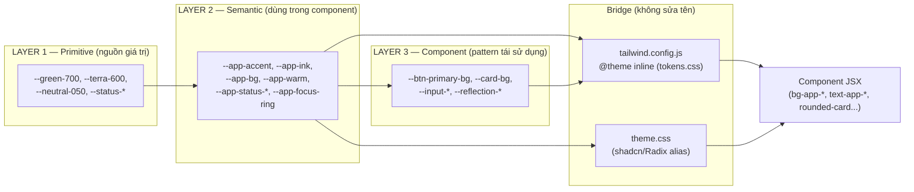
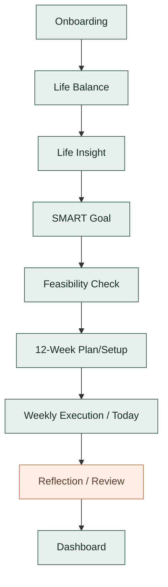

# Design Document — UX/UI Upgrade ("Dear Our Future")

## Overview

Đợt nâng cấp này là một **visual refresh ở mức design token**: tinh chỉnh `Token_Value` trong khi giữ nguyên 100% `Token_Name` và kiến trúc 3 lớp (Primitive → Semantic → Component). Mục tiêu là đưa toàn bộ luồng cốt lõi và Dashboard về đúng định hướng **"Dreamy Guided Productivity"** mô tả trong `docs/DESIGN.md`, đồng thời siết các hard gate về truy cập (contrast, focus, reduced-motion, touch target, responsive), tính nhất quán của trạng thái (loading/empty/error), độ rõ của trạng thái đồng bộ, và an toàn real-mode.

Phạm vi kỹ thuật bám sát ràng buộc đã chốt trong `requirements.md` và `AGENTS.md`:

- **Chỉ chạm lớp trình bày.** Không đổi route, business/domain logic, storage key/shape, analytics, billing/sync/auth/entitlement contract.
- **Token-level refresh.** Giá trị màu/shape/shadow được tinh chỉnh tại lớp Primitive và Semantic trong `src/styles/tokens.css`; các lớp dẫn xuất (`@theme inline` trong `tokens.css`, `tailwind.config.js`, và alias shadcn trong `src/styles/theme.css`) tự kế thừa nên không cần sửa tên token.
- **Định danh ngữ cảnh màu.** `Execution_Context` dùng nhóm `app-accent-*` (forest green); `Reflection_Context` dùng nhóm `app-warm-*` (terracotta). Hai nhóm không trộn lẫn.
- **Không hồi quy.** Phải pass `npm run typecheck`, `npm run lint`, `npm run build`, `npm run test:run`.

Thiết kế này **không** giới thiệu component sản phẩm mới, không mở rộng phạm vi sang side surface (Vision Board, Billing, Admin) trừ khi chúng dùng chung component trạng thái/shell đã có.

### Nguồn tham chiếu đã khảo sát trong codebase

| Hạng mục | Vị trí thực tế | Vai trò trong thiết kế |
| --- | --- | --- |
| Token 3 lớp | `src/styles/tokens.css` | Nguồn `Token_Value` duy nhất được tinh chỉnh |
| Tailwind bridge | `tailwind.config.js` + `@theme inline` trong `tokens.css` | Ánh xạ CSS var → utility, giữ nguyên |
| Alias shadcn/Radix | `src/styles/theme.css` | Dẫn xuất từ `--app-*`, không sửa |
| Page shell | `src/app/components/PageShell.tsx` | Khung trang chuẩn (max-width tier) |
| Tiến độ luồng cốt lõi | `src/app/components/CoreFlowProgress.tsx` | Định nghĩa thứ tự bước + progress |
| Trạng thái dùng chung | `src/app/components/states/` (`EmptyState`, `InlineStatusMessage`, `LocalOnlyNotice`, `OfflineBanner`) | Component empty/error/offline chuẩn |
| Skeleton | `src/app/components/ui/skeleton` (`Skeleton`, `FormSkeleton`) | Trạng thái loading chuẩn |
| AlertDialog | `src/app/components/ui/alert-dialog` | Xác nhận hành động phá hủy (thay `window.confirm`) |
| Sync badge | `src/features/plan12week/pages/12WeekSystem/helpers.ts` (`getSyncBadgeClass`, `getSyncBadgeLabel`) | Hiển thị `Sync_State`; hiện dùng primitive palette → cần migrate |
| App mode | `src/app/utils/app-mode` (`isRealMode`, `isDemoMode`) | Phân nhánh real/demo, giữ nguyên |

## Architecture

### Kiến trúc token 3 lớp (giữ nguyên, chỉ tinh chỉnh giá trị)



Nguyên tắc tham chiếu (bất biến của đợt nâng cấp):

- `Semantic_Token` chỉ tham chiếu `Primitive_Token` hoặc `Semantic_Token` khác.
- `Component_Token` chỉ tham chiếu `Semantic_Token` hoặc `Primitive_Token`.
- Đồ thị tham chiếu không có chu trình (acyclic) và mọi tham chiếu phân giải được về một literal Primitive.
- Tinh chỉnh giá trị thực hiện **ưu tiên tại lớp Primitive** (ví dụ đổi `--green-700`) để cascade tự động xuống Semantic/Component; chỉ sửa trực tiếp Semantic khi cần đổi vai trò ánh xạ (ví dụ `--app-accent-soft` trỏ sang primitive khác).

### Chiến lược "đổi giá trị, giữ tên"

Vì tất cả lớp dẫn xuất (`@theme inline`, `tailwind.config.js`, `theme.css`) tham chiếu qua `var(--app-*)`, việc tinh chỉnh giá trị tại Primitive/Semantic là an toàn và không yêu cầu sửa component. Quy trình:

1. Chụp **baseline token set**: trích toàn bộ `Token_Name` (Semantic + Component) hiện có từ `tokens.css` trước khi sửa.
2. Tinh chỉnh `Token_Value` (Primitive trước, Semantic khi cần).
3. Sau khi sửa, **token set mới phải là superset** của baseline; mọi token baseline phải phân giải về giá trị non-empty, đúng kiểu.
4. Nếu một token baseline biến mất hoặc phân giải rỗng → coi là **thất bại đợt nâng cấp**, báo lỗi chỉ tên token, không ghi đè cấu hình đang chạy.

### Bản đồ ngữ cảnh màu trên luồng cốt lõi



- **Execution_Context** (Onboarding, Life Balance, Life Insight, SMART Goal, Feasibility, 12-Week, Weekly Execution, Dashboard): chỉ dùng `app-accent-*` cho hành động/tiến độ, `app-status-*` cho trạng thái.
- **Reflection_Context** (Reflection/Review, journal review surfaces): chỉ dùng `app-warm-*` (qua `--reflection-*`) cho hành động/tiến độ và focus ring warm.
- Hai nhóm token loại trừ lẫn nhau theo Requirement 2.5 và 2.6.

### Tầng kiểm chứng (verification harness)

Đợt nâng cấp bổ sung **test thuần (pure tests)** đọc trực tiếp `tokens.css` đã build/parse để kiểm chứng các bất biến token, contrast và sync mapping — không phụ thuộc render. Các hành vi DOM (focus, reduced-motion, responsive, trạng thái) dùng component test với Testing Library. Không thêm runtime mới vào sản phẩm.

## Components and Interfaces

Đợt nâng cấp **không tạo component sản phẩm mới**. Nó (a) tinh chỉnh giá trị token, (b) thay primitive palette còn sót bằng status token, và (c) chuẩn hóa việc các Core_Flow_Screen tiêu thụ component dùng chung. Dưới đây là các interface liên quan và thay đổi mức trình bày.

### 1. Token layer (`src/styles/tokens.css`)

Bề mặt tinh chỉnh (giữ nguyên tên):

- Primitive: `--green-*`, `--terra-*`, `--neutral-*`, `--status-*`, `--color-*-accent` (life areas).
- Semantic: `--app-bg*`, `--app-surface`, `--app-ink*`, `--app-line*`, `--app-accent*`, `--app-warm*`, `--app-status-*`, `--app-focus-ring`, `--app-focus-ring-warm`, `--app-radius-*`, `--app-shadow-*`, spacing tokens.
- Component: `--btn-*`, `--input-*`, `--card-*`, `--progress-*`, `--tag-*`, `--reflection-*`.

Hợp đồng: tập `Token_Name` sau nâng cấp ⊇ tập trước nâng cấp; mọi token phân giải non-empty đúng kiểu; quan hệ Light/Dark giữ nguyên tên, chỉ đổi giá trị.

### 2. Shared State Components (`src/app/components/states/`)

| Component | Interface chính (giữ nguyên) | Vai trò sau refresh |
| --- | --- | --- |
| `EmptyState` | `{ title, description?, icon?, illustration?, eyebrow?, actions?, variant, align, headingLevel, testId }` | Trạng thái rỗng chuẩn cho mọi Core_Flow_Screen |
| `InlineStatusMessage` | `{ tone: "info"\|"warning"\|"error"\|"success", role?, icon?, prefix?, children }` | Thông báo lỗi/cảnh báo inline, dùng `--color-*` (đã trỏ về `--app-status-*`) |
| `LocalOnlyNotice` | `{ variant, message?, action? }` | Nhắc dữ liệu cục bộ khi offline/chưa đăng nhập |
| `OfflineBanner` | (no props; đọc `useNetworkStatus`) | Banner offline cố định |
| `Skeleton` / `FormSkeleton` | `{ className, aria-label? }` | Trạng thái loading chuẩn |

Thay đổi mức trình bày bắt buộc (token compliance, Requirement 2.1):

- `OfflineBanner` hiện dùng `bg-red-600` (primitive Tailwind) → thay bằng status token (`bg-app-status-error` hoặc component danger token). Hành vi (dismiss, sessionStorage key `offline-banner-dismissed`, `role="status"`) giữ nguyên.
- `InlineStatusMessage`/`LocalOnlyNotice` đã dùng `--color-*`/`--border`/`--muted` (dẫn xuất từ `--app-*`) → chỉ kế thừa giá trị token mới, không sửa cấu trúc.

Hợp đồng `State` (một Core_Flow_Screen tại một thời điểm hiển thị **đúng một** trong các trạng thái — Requirement 7.7):

```ts
type ScreenDataState =
  | { kind: "loading" }
  | { kind: "empty" }
  | { kind: "error"; retry: () => void }
  | { kind: "ready"; data: unknown };
```

### 3. Sync State Indicator

Hiện trạng: `getSyncBadgeClass`/`getSyncBadgeLabel` (`12WeekSystem/helpers.ts`) suy ra nhãn/màu từ `BackendConnectionStatus` nhưng dùng **primitive palette** (`emerald-*`, `amber-*`, `sky-*`, `slate-*`). Thiết kế chuẩn hóa thành ánh xạ `Sync_State → status token` 1-1, không trùng màu (Requirement 8.3).

Hàm ánh xạ thuần (pure) làm điểm tựa kiểm chứng:

```ts
type SyncState = "synced" | "syncing" | "offline" | "error";

// 4 giá trị → 4 token màu KHÁC NHAU, không trùng lặp
const SYNC_STATE_TOKEN: Record<SyncState, string> = {
  synced:  "app-status-success", // var(--app-status-success)
  syncing: "app-status-info",    // var(--app-status-info)
  offline: "app-status-warning", // var(--app-status-warning)
  error:   "app-status-error",   // var(--app-status-error)
};
```

`BackendConnectionStatus` (đang có) được rút gọn về `Sync_State` chuẩn hóa cho UI:

```ts
function toSyncState(s: BackendConnectionStatus, online: boolean): SyncState {
  if (!online) return "offline";
  if (s.syncing) return "syncing";
  if (s.syncStatus === "error" || s.syncStatus === "partial") return "error";
  return "synced";
}
```

Chỉ báo Sync_State hiển thị cố định, liên tục (không tự ẩn) cho người dùng đã đăng nhập ở real-mode; cập nhật trong ≤ 1 giây khi trạng thái đổi (Requirement 8.1, 8.2). Không thay đổi logic sync/queue thực tế.

### 4. Destructive Action Dialog

`AlertDialog` (`src/app/components/ui/alert-dialog`) đã được dùng cho reset chu kỳ, xóa dữ liệu cục bộ, xóa workspace đã đồng bộ (`TwelveWeekSystemDialogs.tsx`). Hợp đồng giữ nguyên:

- Hành động phá hủy → mở `AlertDialog` với hai lựa chọn rõ ràng (xác nhận / hủy), không dùng `window.confirm` (Requirement 9.3).
- Hủy/đóng → không thực hiện, giữ nguyên dữ liệu (Requirement 9.4).
- Hành động không thể hoàn tác → xác nhận hai bước (ví dụ checkbox + gõ `XOACLOUD`, đã có) (Requirement 9.5).
- Quản lý focus (focus trap + trả focus) do Radix AlertDialog đảm nhiệm; refresh chỉ áp token (`bg-app-status-error` cho action danger, `border-app-line` cho cancel).

### 5. Shell & Focus

- `PageShell` (max-width tier `md/lg/xl/hero`) và `CoreFlowProgress` (thứ tự bước cố định `life_balance → life_insight → smart_goal → feasibility → twelve_week_setup → today`) giữ nguyên thứ tự và nội dung văn bản (Requirement 2.7, 10.4, 10.5).
- Focus ring dùng token `--app-focus-ring` (Execution) / `--app-focus-ring-warm` (Reflection), độ dày ≥ 2px, contrast ≥ 3:1 (Requirement 4).

## Data Models

Đợt nâng cấp **không thêm/sửa data model sản phẩm hay storage shape**. Các "model" dưới đây chỉ là cấu trúc nội bộ phục vụ tinh chỉnh và kiểm chứng token (build-time/test-time), không persist, không vào storage.

### TokenName & TokenValue

```ts
type TokenLayer = "primitive" | "semantic" | "component";
type TokenValueKind = "color" | "length" | "shadow" | "fontFamily" | "number" | "other";

interface TokenDefinition {
  name: string;          // ví dụ "--app-accent" — BẤT BIẾN qua đợt nâng cấp
  layer: TokenLayer;
  rawValue: string;      // ví dụ "var(--green-700)" hoặc "#2A5447"
  kind: TokenValueKind;  // suy ra từ vai trò token
}

type TokenSet = Map<string /* name */, TokenDefinition>;
```

### TokenResolution (phân giải tham chiếu)

```ts
interface ResolvedToken {
  name: string;
  resolvedValue: string;   // literal cuối cùng sau khi đi hết chuỗi var()
  isNonEmpty: boolean;
  kindValid: boolean;      // giá trị hợp kiểu mà token khai báo
}
```

### Baseline snapshot (so sánh trước/sau)

```ts
interface UpgradeBaseline {
  tokenNames: ReadonlySet<string>;  // tên token Semantic + Component trước nâng cấp
  appModeBranching: ReadonlySet<string>; // chữ ký nhánh isRealMode()/isDemoMode() (để so khớp)
}
```

### ThemeMode & SyncState (enum trình bày)

```ts
type ThemeMode = "light" | "dark";
type SyncState = "synced" | "syncing" | "offline" | "error";
```

### Color & Contrast (giá trị thuần để kiểm chứng)

```ts
interface RGB { r: number; g: number; b: number; } // 0..255

// Nền hiệu dụng = tổng hợp mọi lớp overlay/gradient phía sau theo alpha compositing
interface ContrastPair {
  fg: RGB;          // màu chữ / viền control
  effectiveBg: RGB; // nền hiệu dụng liền kề
  isLargeText: boolean;
  isControlAffordance: boolean; // viền/biểu tượng chức năng
}
```

Tất cả model trên chỉ tồn tại trong harness kiểm chứng và lớp ánh xạ trình bày; không có khóa lưu trữ mới, không thay đổi `UserData`, `Goal`, `TwelveWeekSystem`, billing/entitlement/event-log/outbox shape (Requirement 10.1–10.3).

## Correctness Properties

*A property is a characteristic or behavior that should hold true across all valid executions of a system — essentially, a formal statement about what the system should do. Properties serve as the bridge between human-readable specifications and machine-verifiable correctness guarantees.*

Phần lớn đợt nâng cấp này là trình bày/UI (sẽ kiểm bằng unit/component/e2e/smoke — xem Testing Strategy). Tuy nhiên một số tiêu chí là **hàm thuần, biến thiên theo đầu vào, đáng chạy 100+ vòng** — đó là các property dưới đây. Mỗi property được rút ra và rút gọn từ phần prework (đã gộp các tiêu chí trùng lặp).

### Property 1: Token integrity — giữ tên, phân giải non-empty đúng kiểu

*For any* `Token_Name` tồn tại trong baseline token set (Semantic + Component) trước đợt nâng cấp, token đó vẫn tồn tại sau đợt nâng cấp (tập sau là superset của tập trước), được expose qua bridge, và phân giải (đi hết chuỗi `var()`) về một `Token_Value` non-empty, hợp đúng kiểu giá trị mà nó khai báo (color/length/shadow/fontFamily/number).

**Validates: Requirements 1.1, 1.2, 1.4, 1.5**

### Property 2: WCAG contrast trên mọi cặp màu của luồng cốt lõi

*For any* `ThemeMode` ∈ {light, dark} và *for any* cặp (foreground, effective background) trong ma trận token của Core_Flow_Screen — bao gồm text thường, text lớn, viền/biểu tượng chức năng của control, placeholder, focus ring (accent và warm), và các biến thể trạng thái hover/active/selected — `Contrast_Ratio` (công thức WCAG 2.1 trên nền hiệu dụng sau alpha-compositing) đạt tối thiểu ngưỡng tương ứng: 4.5:1 cho text thường và placeholder, 3:1 cho text lớn, viền/biểu tượng control và focus ring. Các cặp thuộc control `disabled` được loại khỏi tập kiểm tra.

**Validates: Requirements 3.1, 3.2, 3.3, 3.4, 3.5, 3.6, 3.8, 4.2, 4.4**

### Property 3: Phân vùng ngữ cảnh màu (Execution ↔ Reflection)

*For any* phần tử giao diện thuộc `Execution_Context`, tập token nó dùng cho hành động/tiến độ không giao với nhóm warm (`app-warm-*` / `--reflection-*`); và *for any* phần tử thuộc `Reflection_Context`, tập token dùng cho hành động/tiến độ không giao với nhóm accent (`app-accent-*`).

**Validates: Requirements 2.3, 2.4, 2.5, 2.6**

### Property 4: Bất biến cấu trúc 3 lớp (hướng tham chiếu + acyclic)

*For any* token trong hệ thống, chuỗi tham chiếu của nó tuân thủ hướng hợp lệ — `Semantic_Token` chỉ tham chiếu `Primitive_Token` hoặc `Semantic_Token` khác; `Component_Token` chỉ tham chiếu `Semantic_Token` hoặc `Primitive_Token` — và đồ thị tham chiếu không có chu trình, tức mọi chuỗi `var()` kết thúc tại một literal Primitive sau hữu hạn bước.

**Validates: Requirements 1.3**

### Property 5: Máy trạng thái màn hình — loại trừ lẫn nhau và retry

*For any* chuỗi sự kiện tải dữ liệu áp lên một Core_Flow_Screen, `ScreenDataState` tại mọi thời điểm luôn là **đúng một** trong {loading, empty, error, ready} (không bao giờ có hai trạng thái cùng hiển thị); và *for any* trạng thái `error`, kích hoạt `retry()` luôn chuyển hệ về trạng thái `loading`.

**Validates: Requirements 7.7, 7.5**

### Property 6: Ánh xạ Sync_State → status token là đơn ánh

*For any* hai giá trị `Sync_State` khác nhau trong {synced, syncing, offline, error}, status token được ánh xạ tới là khác nhau; do đó ảnh của ánh xạ gồm đúng 4 token màu phân biệt, không trùng lặp.

**Validates: Requirements 8.3**

### Property 7: An toàn dữ liệu khi hủy hành động phá hủy

*For any* hành động phá hủy dữ liệu được kích hoạt từ một Core_Flow_Screen, nếu người dùng chọn hủy hoặc đóng `AlertDialog`, thì trạng thái dữ liệu sau thao tác bằng đúng trạng thái dữ liệu trước thao tác (không có bản ghi nào bị xóa hay ghi đè).

**Validates: Requirements 9.4**

### Property 8: Không rò rỉ ngôn từ demo-only ở real-mode

*For any* chuỗi văn bản hiển thị trên Core_Flow_Screen khi ứng dụng chạy ở real-mode, chuỗi đó không chứa bất kỳ cụm từ nào trong tập kiểm duyệt {"dùng thử", "không thu tiền thật", "mock", "demo", "trên trình duyệt này", "không cần đăng nhập", "bản dùng thử trên trình duyệt"} (so khớp không phân biệt hoa thường).

**Validates: Requirements 9.1**

### Property 9: Bất biến tập storage key

*For any* `Token_Value` được tinh chỉnh trong đợt nâng cấp, tập tên các storage key sau đợt nâng cấp bằng đúng (equality) tập tên storage key trước đợt nâng cấp — không thêm, không đổi tên, không xóa key nào.

**Validates: Requirements 10.1**

## Error Handling

### Token resolution failure (Requirement 1.6, 2.8)

- **Phát hiện trước khi áp dụng:** harness kiểm chứng so token set mới với baseline. Nếu một `Token_Name` baseline bị thiếu, bị xóa, hoặc phân giải rỗng/không hợp kiểu → đợt nâng cấp bị coi là **thất bại**, báo lỗi liệt kê chính xác tên token bị ảnh hưởng, và **không ghi đè** cấu hình token đang chạy trước đó.
- **Fallback runtime:** nếu một phần tử tham chiếu token không phân giải được tại runtime, áp giá trị mặc định đã định nghĩa (qua chuỗi `var(--token, <fallback>)` hoặc giá trị Semantic mặc định) để phần tử vẫn có màu nền/màu chữ hiển thị được — không để trống.

### Data-load failure (Requirement 7.3, 7.6)

- Lỗi tải → render `InlineStatusMessage tone="error"` (hoặc error block dùng chung) kèm control **thử lại**; dữ liệu cục bộ giữ nguyên, không xóa/reset.
- Quá 30 giây không hoàn tất → coi như lỗi, chuyển sang trạng thái error + retry (timeout guard).
- Nội dung copy theo mẫu calm/recoverable: *điều gì xảy ra → cái gì vẫn an toàn → bước tiếp theo*.

### Sync failure (Requirement 8.4, 8.5)

- `Sync_State = error` → chỉ báo lỗi + thông tin "lần đồng bộ gần nhất chưa hoàn tất"; dữ liệu cục bộ giữ nguyên (không ghi đè). Không nuốt lỗi sync.
- `Sync_State = offline` → chỉ báo "chưa xác nhận lưu trên máy chủ", vẫn cho thao tác trên dữ liệu cục bộ (local-first). `OfflineBanner` + `LocalOnlyNotice` đảm nhiệm thông điệp.

### Destructive actions (Requirement 9.3, 9.4, 9.5)

- Mọi hành động phá hủy đi qua `AlertDialog` (không `window.confirm`), hai lựa chọn rõ ràng; hành động không thể hoàn tác yêu cầu xác nhận hai bước (checkbox + gõ chuỗi xác nhận, theo mẫu `XOACLOUD` đã có). Hủy/đóng → no-op, giữ nguyên dữ liệu. Focus được trap và trả về trigger (Radix đảm nhiệm).

### Reduced-motion & responsive degradation (Requirement 5, 6)

- `prefers-reduced-motion: reduce` → vô hiệu hóa motion không thiết yếu; motion thiết yếu giới hạn ≤ 200ms; toàn bộ control vẫn truy cập được.
- Viewport < 360px → giữ bố cục mốc 360px, cho phép cuộn ngang trong vùng nội dung mà không cắt Touch_Target.

## Testing Strategy

Cách tiếp cận kép: **property-based test** cho các bất biến thuần (Property 1–9) + **unit/component/e2e/smoke test** cho hành vi UI cụ thể, edge case và CI gates.

### Property-based testing

- **Thư viện:** dùng **`fast-check`** (đã phù hợp hệ sinh thái Vitest/TS của dự án); KHÔNG tự viết PBT từ đầu.
- **Cấu hình:** mỗi property test chạy **tối thiểu 100 vòng** (`fc.assert(..., { numRuns: 100 })`).
- **Tag bắt buộc** cho mỗi property test, theo định dạng: `Feature: ux-ui-upgrade, Property {number}: {property_text}`.
- **Nguồn dữ liệu:** parse `src/styles/tokens.css` (và `theme.css`) thành `TokenSet`/đồ thị tham chiếu để cấp dữ liệu cho generator; với contrast, sinh/duyệt ma trận cặp màu theo {ThemeMode, loại phần tử, trạng thái}.

Ánh xạ property → cách hiện thực:

| Property | Hiện thực test |
| --- | --- |
| 1 — Token integrity | Parse baseline + new `TokenSet`; generator chọn token bất kỳ; assert superset + resolvable non-empty đúng kiểu |
| 2 — Contrast | Generator sinh cặp (fg, effective bg) theo ThemeMode/loại/ngưỡng/trạng thái; assert contrast ≥ ngưỡng; loại disabled |
| 3 — Color context partition | Generator chọn node trong cây render màn Execution/Reflection; assert không giao tập token nghịch ngữ cảnh |
| 4 — 3-layer reference | Dựng đồ thị từ `var()`; generator chọn token; assert hướng hợp lệ + chuỗi phân giải hữu hạn (acyclic) |
| 5 — State machine | Mô hình hóa `ScreenDataState`; generator sinh chuỗi sự kiện; assert mutual exclusion + retry(error)→loading |
| 6 — Sync mapping | Generator chọn cặp SyncState; assert injective; |image| = 4 |
| 7 — Destructive cancel | Generator sinh (hành động phá hủy, quyết định ∈ {cancel, dismiss}); assert dữ liệu sau = trước |
| 8 — Demo copy | Generator sinh/duyệt tập copy real-mode core-flow; assert không match banned phrase |
| 9 — Storage keys | So sánh tập key trước/sau; assert equality |

### Unit & component testing (Testing Library + Vitest)

- **Token compliance scan (R2.1):** test/lint quét các file Core_Flow_Screen tìm hex literal và primitive palette (`slate-*`, `emerald-*`, `amber-*`, `sky-*`, `purple-*`, `red-600`...). Sửa và phủ `OfflineBanner` (`bg-red-600`) và sync badge helpers (`getSyncBadgeClass`).
- **States (R7.1–7.4, 7.6):** mount màn ở từng nhánh loading/empty/error/ready → assert đúng component dùng chung (`Skeleton`/`FormSkeleton`, `EmptyState`, error block), 30s timeout chuyển error.
- **Sync indicator (R8.1, 8.2, 8.4, 8.5):** real-mode + signedIn → badge cố định luôn hiện; đổi `BackendConnectionStatus` → cập nhật nhãn/màu; error/offline copy đúng.
- **Focus & keyboard (R4.1, 4.3, 4.5, 4.6, 4.7):** `userEvent.tab()`/`shift+tab` kiểm thứ tự đọc; focus → có ring ≥ 2px; blur → gỡ ring.
- **Reduced motion (R5.1–5.5):** mock `matchMedia('(prefers-reduced-motion: reduce)')`; assert vô hiệu motion không thiết yếu, motion thiết yếu ≤ 200ms, control vẫn thao tác, toggle áp dụng không reload.
- **Destructive dialog (R9.3, 9.5):** trigger destructive → `AlertDialog` mở với confirm/cancel; irreversible → hai bước; grep đảm bảo không `window.confirm` trong core-flow.
- **Real-mode/demo gating (R9.2, 9.6):** real-mode không register route demo (`/billing/mock-checkout`, seeders); phân nhánh `isRealMode()/isDemoMode()` khớp baseline.
- **Content & order (R2.7, 10.4, 10.5):** snapshot nội dung văn bản/nhãn + thứ tự `CoreFlowProgress` steps so baseline.
- **No-regression dữ liệu (R10.2, 10.3):** giữ test storage hiện có pass; dữ liệu mẫu trước/sau còn nguyên.

### E2E / visual (Playwright)

- **Responsive (R6.1–6.6):** mốc viewport 320/360/414/767/768/1024 → assert không cuộn ngang ở 360–767px, spacing desktop ≥768px, padding mobile <768px, Touch_Target ≥ 44px và khoảng cách ≥ 8px (đo layout thực), <360px giữ bố cục 360px.

### Smoke / CI gates (R10.6–10.10)

```bash
npm run typecheck   # exit 0, không lỗi kiểu mới
npm run lint        # exit 0 (gồm token-compliance rule)
npm run test:run    # 0 fail trên test core-flow hiện có
npm run build       # exit 0, ra artifact
```

Bất kỳ test hiện có nào fail sau đợt nâng cấp → coi là **không đạt** tiêu chí không-hồi-quy cho tới khi khắc phục về pass (R10.7).
